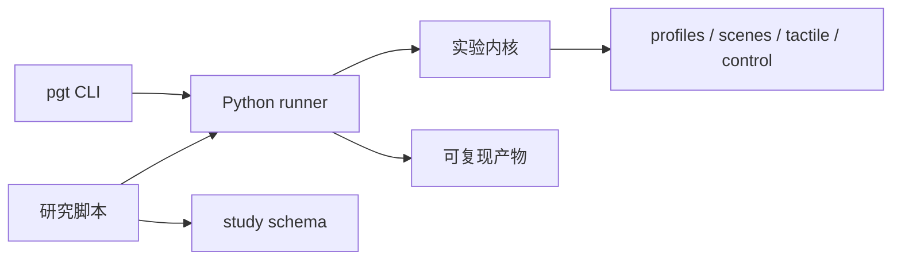

# 🤖 Parallel Gripper Tactile

MuJoCo 二指平行夹爪触觉仿真：使用通过 schema 校验的 YAML profile、单一 `pgt` 命令，以及
可复现的逐次运行产物（run artifacts）。

## 🚀 快速开始

```bash
uv sync
uv run pgt validate configs/robotiq_2f85.yaml
uv run pgt validate configs/custom_parallel_gripper.yaml
uv run pgt run demo --profile configs/robotiq_2f85.yaml
uv run pgt run grasp --profile configs/custom_parallel_gripper.yaml
uv run pgt run force-track --profile configs/custom_parallel_gripper.yaml --task configs/force_tracking/default_waypoints.yaml
uv run pgt run force-schedule --profile configs/custom_parallel_gripper.yaml --task configs/force_scheduling/gravity_hold.yaml
uv run pgt run force-schedule --profile configs/custom_parallel_gripper.yaml --task configs/force_scheduling/dynamic_filling.yaml
# 自研夹爪可选 soft / medium / hard / stiff 显式触觉接触 preset（默认 hard）
uv run pgt run grasp --profile configs/custom_parallel_gripper.yaml --object-material soft
uv run pgt run force-track --profile configs/custom_parallel_gripper.yaml --task configs/force_tracking/default_waypoints.yaml --object-material medium
uv run pgt run force-track --profile configs/custom_parallel_gripper.yaml --task configs/force_tracking/default_waypoints.yaml --controller-variant full --object-material hard --sensor-noise-seed 0
```

Profile 仅使用 YAML。它们是不可变的 Pydantic v2 模型：未知字段、非法控制限幅、空/多文档输入、
未解析的模型路径都会在仿真开始前失败。相对模型路径以 profile 所在目录为基准解析。

## 🧰 命令

```text
pgt validate PROFILE
pgt assets generate-taxels [--shape sphere|box]
pgt assets generate-touch-grid
pgt assets prepare-onshape INPUT OUTPUT
pgt run demo --profile PROFILE
pgt run grasp --profile PROFILE [--video] [--object-material soft|medium|hard|stiff]
pgt run force-schedule --profile PROFILE --task TASK.yaml
pgt run force-track --profile PROFILE --task TASK.yaml [--viewer] [--disable-multiccd]
                    [--object-material soft|medium|hard|stiff]
                    [--trace-period SECONDS] [--event-window SECONDS]
pgt compare tactile --left-profile A --right-profile B
pgt compare contact --profile PROFILE
pgt view taxels --profile PROFILE
pgt view grasp --profile PROFILE [--object-material soft|medium|hard|stiff]
pgt runs list
pgt runs clean (--older-than-days N | --all | --cache) [--apply]
```

仿真默认无界面（headless）。`pgt run force-track --viewer` 会在运行 waypoint
目标力跟踪任务时同步打开 MuJoCo GUI；`pgt view` 会打开静态交互检查场景。Typer 通过
`pgt --install-completion` 提供 shell 补全。

`pgt run grasp` 和 `force-track` 支持 `--run-prefix` 与
`--run-suffix`。它们会保留自动生成的 UTC 时间戳和短 ID，例如
`trial-20260830T104726Z-6dc7385b`；原有 `--run-name` 仍用于指定完整、不可改写的目录名，
不能与前缀或后缀同时使用。

`pgt run force-schedule` 根据切向载荷和已知摩擦系数 `μ` 调度平均单侧法向目标力。标准 task
`gravity_hold.yaml` 验证仅重力保持，`dynamic_filling.yaml` 用沿重力方向的 0→2 N 附加载荷模拟注水。
当前实现使用场景真值 `μ`，是 oracle 基线而非摩擦系数估计器；详见
[Oracle 抓取目标力调度](docs/force-scheduling.md)。

力控消融的四个跟踪阶段变体为：

| 变体 | PID | 刚度位置前馈 | 力矩前馈 |
| --- | --- | --- | --- |
| `pid-only` | 开 | 关 | 关 |
| `pid-torque-ff` | 开 | 关 | 开 |
| `pid-stiffness-ff` | 开 | 开 | 关 |
| `full` | 开 | 开 | 开 |

所有变体共享相同的接近阶段和 waypoint 任务。

## 🧪 Research studies

`pgt` 提供确定参数下的单次实验；`scripts/experiments` 保存 controller、材料和重复次数组成的
多次科研 protocol。运行力跟踪消融研究：

```bash
uv run python scripts/experiments/force_tracking_ablation.py \
    --config configs/studies/force_tracking_ablation.yaml
```

该 study 直接调用 Python runner，而非通过子进程调用 CLI。它会在 `outputs/studies` 创建独立父目录，
保存 study 配置、逐次结果、聚合统计和每个子 run 的可复现工件。

跨 `step`、`ramp`、`mixed_waypoints` 三类任务的规范化控制器对比先用 `--dry-run` 审阅 162 个条件，
确认后再执行完整 study：

```bash
uv run python scripts/experiments/force_tracking_controller_comparison.py \
    --config configs/studies/force_tracking_controller_comparison.yaml \
    --dry-run
uv run python scripts/experiments/force_tracking_controller_comparison.py \
    --config configs/studies/force_tracking_controller_comparison.yaml
```

该 protocol 额外生成按控制器分组的误差、饱和比例、相对 Full 的消融增量和同 seed 轨迹对比图。
每张图同时保存为 600 DPI PNG 和嵌入 TrueType 字体的矢量 PDF。已完成的 study 可不重新仿真，直接重绘：

```bash
uv run python scripts/experiments/force_tracking_controller_comparison.py \
    --render-study-dir outputs/studies/force_tracking_controller_comparison/<study-id>
```
默认正式矩阵使用 `medium=(-650,-8)`、`hard=(-1200,-10)` 和新增的
`stiff=(-2500,-15)`；`soft=(-250,-5)` 仅保留用于兼容和专项接触标定，不进入默认批量研究。

## 🧩 Profiles

| Profile | 控制 | 触觉后端 |
| --- | --- | --- |
| `robotiq_2f85.yaml` | position | `force_sensor` |
| `robotiq_2f85_box.yaml` | position | box 的 `force_sensor` |
| `robotiq_2f85_touch_grid.yaml` | position | `touch_grid` |
| `custom_parallel_gripper.yaml` | MIT 力矩 + 法向力外环 | `contact_geom` |

自研夹爪的 Pillars 有意使用等效软接触，而非独立的可变形硅胶体：
`solref="-1200 -10"`、`solimp="0.75 0.95 0.0025 0.5 2"`。当前仿真接触响应约为
`1200 N/m`；产品量程换算只能作为设计背景，不能替代仓库模型参数。

## 📦 运行产物

每个产出结果（result-producing）的命令都会创建独占目录：

```text
outputs/<profile>/<experiment>/<UTC timestamp>-<id>/
├── manifest.json
├── profile.yaml
├── effective_parameters.json  # force-track
├── trace.parquet              # force-track
├── trace.csv                  # force-schedule
├── metrics.json
├── plot.png
├── plot.pdf
└── video.mp4
```

`manifest.json` 只列出实际产出的产物，并记录 profile 哈希、Git 状态、依赖版本、参数与创建时间。
人工编写的 profile、task 与 study 继续使用 YAML；`effective_parameters.json` 则记录解析后的完整
profile、task 以及本次实际生效的运行时覆盖，作为 force-track run 的机器可读复现实参。默认时序数据为
使用 Zstd 压缩的 `trace.parquet`。普通控制器常规区段默认记录为 100 Hz，直接力矩 ADRC 记录为
250 Hz；阶段切换、限幅状态变化和 waypoint 前后 0.2 s 仍保留完整控制频率。指标计算和绘图始终使用
仿真中的完整频率数据，降采样只影响落盘 trace。读取接口仍兼容旧版 CSV API 和既有 `trace.csv` 历史产物。
单次运行同时生成 600 DPI PNG 和矢量 PDF；Step、Ramp 与 Mixed/Smoothstep 分别突出瞬态误差、
加载—卸载滞后和 waypoint 误差。CLI 可用 `--trace-period` 覆盖常规采样周期；该值必须是
任务控制周期的整数倍，设为控制周期即可保留全频常规数据。
`pgt runs clean` 默认只预览将删除的目标；需要删除时加 `--apply`。

`force-schedule` 的运行目录还包含 `task.yaml`；其 `effective_parameters.json` 明确记录 oracle
调度器，`trace.csv` 保存载荷、目标力、摩擦裕量和滑移时序。标准重力保持与动态注水场景当前分别达到
约 `0.009 N`、`0.030 N` 的力跟踪 RMSE，最大切向位移均约 `0.009 mm`；动态注水最终目标约为
`2.335 N/侧`。

## 🏗️ 架构



`pgt` 与 `scripts/experiments` 是两个入口：前者执行单次实验，后者编排多条件 protocol；二者直接复用
Python runner，不通过 CLI 子进程互相调用。一次实验内只有一个步进循环拥有对应的 `MjData`。所有触觉
读取器在不可变坐标系中返回局部 `(3, rows, cols)` 力数组，压缩以正的 `Fz` 表示。完整边界、运行产物
数据流和依赖规则见[项目架构](docs/architecture.md)。

## 🧲 接触模型决策

实验性的 Drake/Hydroelastic 桥接已从主线移除。它未经标定、对本模型无材料准确性收益、存在穿透限制，
且每次求值约 0.510 ms——约为 mesh-SDF 比较路径的 30 倍。原生 MuJoCo 接触与 mesh-SDF 仍可用于
A/B 实验。

## 🛠️ 开发

```bash
PYTEST_DISABLE_PLUGIN_AUTOLOAD=1 uv run pytest
uv run ruff check .
uv run ruff format --check .
```

见[代码与注释规范](docs/coding-conventions.md)与 [CONTRIBUTING](CONTRIBUTING.md)。
