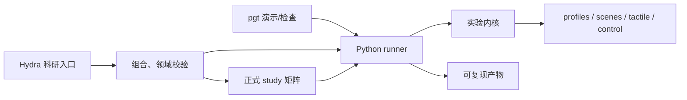

# 🤖 Parallel Gripper Tactile

MuJoCo 二指平行夹爪触觉仿真：使用通过 schema 校验的 YAML profile、单一 `pgt` 命令，以及
可复现的逐次运行产物（run artifacts）。

## 🚀 快速开始

```bash
uv sync --all-packages --locked
uv run pgt validate configs/robotiq_2f85.yaml
uv run pgt validate configs/dm_gripper.yaml
uv run pgt run demo --set model=robotiq_2f85/touch_grid_3x3
uv run pgt run grasp --video
uv run pgt run force-track --set controller=dm_gripper/full --set task=force_tracking/default_waypoints
uv run pgt run force-schedule --experiment dm_gripper/force_scheduling_gravity_hold
uv run pgt run force-schedule --experiment dm_gripper/force_scheduling_dynamic_filling
uv run pgt run friction-estimate --experiment dm_gripper/friction_estimation_nominal
uv run pgt run discrete-force --experiment robotiq_2f85/discrete_force
```

Profile 仅使用 YAML。它们是不可变的 Pydantic v2 模型：未知字段、非法控制限幅、空/多文档输入、
未解析的模型路径都会在仿真开始前失败。相对模型路径以 profile 所在目录为基准解析。

## 🧰 命令

```text
pgt validate PROFILE
pgt assets generate-taxels [--shape sphere|box]
pgt assets generate-touch-grid
pgt assets prepare-onshape INPUT OUTPUT
pgt run demo [--experiment NAME] [--set KEY=VALUE]
pgt run grasp [--experiment NAME] [--set KEY=VALUE] [--video]
pgt run force-schedule [--experiment NAME] [--set KEY=VALUE]
pgt run friction-estimate [--experiment NAME] [--set KEY=VALUE]
pgt run discrete-force [--experiment NAME] [--set KEY=VALUE]
pgt run force-track [--experiment NAME] [--set KEY=VALUE]
pgt compare tactile [--left-set KEY=VALUE] [--right-set KEY=VALUE]
pgt compare contact [--experiment NAME] [--set KEY=VALUE]
pgt view taxels [--experiment NAME] [--set KEY=VALUE]
pgt view grasp [--experiment NAME] [--set KEY=VALUE]
pgt runs list
pgt runs clean (--older-than-days N | --all | --cache) [--apply]
```

仿真默认无界面（headless）。`pgt run force-track --set execution.viewer=true` 会在运行 waypoint
目标力跟踪任务时同步打开 MuJoCo GUI；`pgt view` 会打开静态交互检查场景。Typer 通过
`pgt --install-completion` 提供 shell 补全。

`pgt run grasp` 和 `force-track` 支持 `--run-prefix` 与
`--run-suffix`。它们会保留自动生成的 UTC 时间戳和短 ID，例如
`trial-20260830T104726Z-6dc7385b`；原有 `--run-name` 仍用于指定完整、不可改写的目录名，
不能与前缀或后缀同时使用。

`pgt run force-schedule` 根据切向载荷和已知摩擦系数 `μ` 调度平均单侧法向目标力。标准 task
`gravity_hold.yaml` 验证仅重力保持，`dynamic_filling.yaml` 用沿重力方向的 0→2 N 附加载荷模拟注水。
当前实现使用场景真值 `μ`，是 oracle 基线而非摩擦系数估计器；详见
[Oracle 抓取目标力调度](docs/force-scheduling.md)。

`pgt run friction-estimate` 在世界 `+Y` 方向执行慢速切向探测，仅用已知探测载荷和双侧三轴触觉
合力检测力域初始滑移，生成安全折减后的摩擦系数下界，再用该下界运行目标力调度。真实 `μ` 和物体
运动只用于离线评分；详见[微滑移探测与保守摩擦估计](docs/friction-estimation.md)。

`pgt run discrete-force` 在 Robotiq 2F-85 的 `0～255` 整数命令空间中估计稳定动作前后的
`ΔF_tick`，并以此调整 HOLD 死区、再激活阈值、动作预测和 1～3 tick 动态步长；统一量化 PI 与四级离散
消融、四种接触刚度和完整 study 见[Robotiq 2F-85 离散力控制](docs/discrete-force-control.md)。

力控消融的四个跟踪阶段变体为：

| 变体 | PID | 刚度位置前馈 | 力矩前馈 |
| --- | --- | --- | --- |
| `pid-only` | 开 | 关 | 关 |
| `pid-torque-ff` | 开 | 关 | 开 |
| `pid-stiffness-ff` | 开 | 开 | 关 |
| `full` | 开 | 开 | 开 |

另有两个刚度控制结构用于验证：`pid-stiffness-limit` 以在线刚度限制位置式 PID 的逐周期增量；
`pid-stiffness-rate` 令 PID 输出 \(\dot F\)，再经 \(\hat k_cJ_c(q)\) 映射为 \(\dot q\)，并按实际
外环周期 \(T_c\) 积分为位置修正。

所有变体共享相同的接近阶段和 waypoint 任务。

## 🧪 Research studies

`pgt` 保留用于演示、模型查看、设备检查和简单预设运行；科研组合使用独立的 Hydra 原生入口。
先以计划模式完成领域校验而不推进仿真：

```bash
uv run python scripts/research/run.py \
  execution=plan controller=dm_gripper/full task=force_tracking/step material=medium seed=0
```

单次科研运行、DM 共享导纳和探索性 Multirun：

```bash
uv run python scripts/research/run.py \
  controller=dm_gripper/adrc_torque estimator=window_linear task=force_tracking/ramp material=hard seed=0
uv run python scripts/research/run.py experiment=dm_gripper/force_tracking_admittance
uv run python scripts/research/run.py experiment=dm_gripper/force_tracking_pid_unified
uv run python scripts/research/run.py experiment=dm_gripper/force_tracking_admittance_unified
uv run python scripts/research/run.py -m \
  material=medium,hard,stiff seed=0,1,2
```

PID 与二阶导纳的控制律对比使用后两个 `*_unified` 入口。它们共享
`1→3→6→1 N` Ramp、4 ms 外环、MIT 内环、接近轨迹和公共接触状态机；原
`force_tracking_admittance` 继续保留 ROS 共享导纳基线语义。

正式研究建议按“基础组件验证 → 参数调优 → 人工审查并冻结候选配置 → 最终控制器比较”推进；
局部起滑和 Robotiq 离散力属于独立研究，不阻塞 DM 力控制器选型。只有 Torque ADRC 的
`coarse → confirm` 是程序强制的阶段依赖，其余顺序是科学决策建议。Study 之间不会自动回写最优参数，
因此最终控制器比较前必须先审查前置结果，必要时更新配置并形成可追溯提交。

推荐路线如下：

```text
刚度参考合理性检查 ────────┐
刚度位置限幅三臂实验 ──────┤
刚度速率控制频率验证 ──────┤
PID 模块消融 ──────────────┼→ 人工审查／冻结 PID-ADRC 候选 → 最终控制器比较
Torque ADRC coarse → confirm ┘

共享导纳调优 → 冻结共享导纳基线（不进入上述选型）
局部起滑验证、Robotiq 离散力验证：独立研究
```

默认是计划模式；确认计划后增加 `execution=study_run` 执行。常用入口为：

```bash
uv run python scripts/research/study.py \
  research=stiffness_ground_truth_validation/study
uv run python scripts/research/study.py \
  research=force_tracking_stiffness_limit_pilot/study
uv run python scripts/research/study.py \
  research=force_tracking_stiffness_rate_validation/study
uv run python scripts/research/study.py \
  research=force_tracking_stiffness_rate_tuning/study
uv run python scripts/research/study.py \
  research=force_tracking_stiffness_rate_refinement/study
uv run python scripts/research/study.py \
  research=force_tracking_stiffness_rate_confirmation/study
uv run python scripts/research/study.py research=force_controller_ablation/study
uv run python scripts/research/study.py \
  research=torque_adrc_tuning/study
uv run python scripts/research/study.py \
  research=torque_adrc_tuning/study study.stage=confirm \
  study.coarse_study_dir=/absolute/path/to/coarse-study
uv run python scripts/research/study.py \
  research=force_controller_selection/study
```

执行模式可用 `execution.workers=N` 在 CPU 上并行运行相互独立的 MuJoCo 条件；例如本机先从
`execution.workers=8` 开始。该参数只改变调度，不进入科学配置哈希；manifest、聚合与绘图仍由父进程
按 `StudyPlan` 顺序写入。计划模式不会创建 worker。

控制器对比矩阵为 `pid-only`、`pid-torque-ff`、`pid-stiffness-ff`、`full`、
`pid-stiffness-rate`、`adrc-torque` × 3 个任务 × 3 个正式材料 × 3 个 seed，共 162 条；
`pid-stiffness-limit` 因 stiff Step 平台极限环退出最终矩阵，只保留专项复现实验；
消融矩阵为四个 PID 2×2 变体 × 3 个材料 × 3 个 seed，共 36 条。正式 study 明确拒绝 Hydra
外层 Multirun，避免重复展开。Torque coarse 为 102 条；confirm 严格校验 coarse manifest、科学配置
哈希和排名摘要后，按“可行前五＋缺席时追加基线”的规则生成确认矩阵。

Hydra 负责外层科研调用目录和组合溯源，现有 artifacts 继续管理每个实验的 manifest、trace、metrics
与图。公共 study manifest 区分计划、运行中、部分完成、完成与失败状态，也区分科学验收失败、执行异常
和聚合／绘图异常；稳定科学哈希不包含 cwd、时间或输出目录。恢复功能本阶段只生成兼容性报告，不会
自动续跑。计划/执行、配置组所有权、覆盖规则、输出结构与兼容入口详见
[Hydra 科研配置与实验编排](docs/research-configuration.md)，可直接执行的推荐顺序见
[工作流](docs/workflows.md#推荐的正式研究执行顺序)。

## 🧩 Profiles

| Profile | 控制 | 触觉后端 |
| --- | --- | --- |
| `robotiq_2f85.yaml` | position | `force_sensor` |
| `model=robotiq_2f85/box_force_sensor` | position | box 的 `force_sensor` |
| `model=robotiq_2f85/touch_grid_3x3` | position | `touch_grid` |
| `dm_gripper.yaml` | MIT 力矩 + 法向力外环 | `contact_geom` |

DM_Gripper 的 Pillars 有意使用等效软接触，而非独立的可变形硅胶体：
`solref="-1200 -10"`、`solimp="0.75 0.95 0.0025 0.5 2"`。
这些求解器参数不能直接解释为整条接触链路的 N/m 刚度；等效刚度需通过独立力—闭合扫描测量。

## 📦 运行产物

每个产出结果（result-producing）的命令都会创建独占目录：

```text
outputs/<profile>/<experiment>/<UTC timestamp>-<id>/
├── manifest.json
├── profile.yaml
├── effective_parameters.json  # force-track / discrete-force / force-schedule / friction-estimate
├── trace.parquet              # force-track
├── trace.csv                  # discrete-force / force-schedule / friction-estimate
├── metrics.json
├── plot.png                   # force-track 之外的单次实验
├── plots/                     # force-track
│   ├── tracking.png
│   ├── tactile.png
│   └── controller.png
└── video.mp4
```

`manifest.json` 只列出实际产出的产物，并记录 profile 哈希、Git 状态、依赖版本、参数与创建时间。
人工编写的 profile、task 与 study 继续使用 YAML；`effective_parameters.json` 则记录解析后的完整
profile、task 以及本次实际生效的运行时覆盖，作为 force-track run 的机器可读复现实参。默认时序数据为
使用 Zstd 压缩的 `trace.parquet`。普通控制器常规区段默认记录为 100 Hz，直接力矩 ADRC 记录为
250 Hz；阶段切换、限幅状态变化和 waypoint 前后 0.2 s 仍保留完整控制频率。指标计算和绘图始终使用
仿真中的完整频率数据，降采样只影响落盘 trace。读取接口仍兼容旧版 CSV API 和既有 `trace.csv` 历史产物。
force-track 单次运行默认生成三张 600 DPI PNG，分别展示目标力跟踪、双侧触觉力和控制器行为；
坐标轴使用带单位的数学符号，Ramp waypoint 直接标在参考曲线上。CLI 可用 `--trace-period`
覆盖常规采样周期；该值必须是任务控制周期的整数倍，设为控制周期即可保留全频常规数据。
`pgt runs clean` 默认只预览将删除的目标；需要删除时加 `--apply`。

`force-schedule` 的运行目录还包含 `task.yaml`；其 `effective_parameters.json` 明确记录 oracle
调度器，`trace.csv` 保存载荷、目标力、摩擦裕量和滑移时序。标准重力保持与动态注水场景当前分别达到
约 `0.009 N`、`0.030 N` 的力跟踪 RMSE，最大切向位移均约 `0.009 mm`；动态注水最终目标约为
`2.335 N/侧`。

`friction-estimate` 的运行目录同样保存 task、有效参数、CSV 轨迹、指标和图。有效参数会明确声明估计器
不消费 oracle 信号；标准低、中、高摩擦和两倍噪声场景的保守估计约为真值的 89%–92%。

## 🏗️ 架构



`pgt` 与 Hydra 科研入口直接复用 Python runner，不通过 CLI 子进程互相调用。一次实验内只有一个步进
循环拥有对应的 `MjData`。所有触觉
读取器在不可变坐标系中返回局部 `(3, rows, cols)` 力数组，压缩以正的 `Fz` 表示。完整边界、运行产物
数据流和依赖规则见[项目架构](docs/architecture.md)。

## 🧲 接触模型决策

实验性的 Drake/Hydroelastic 桥接已从主线移除。它未经标定、对本模型无材料准确性收益、存在穿透限制，
且每次求值约 0.510 ms——约为 mesh-SDF 比较路径的 30 倍。原生 MuJoCo 接触与 mesh-SDF 仍可用于
A/B 实验。

## 🛠️ 开发

```bash
PYTEST_DISABLE_PLUGIN_AUTOLOAD=1 uv run pytest
uv run ruff check .
uv run ruff format --check .
```

见[代码与注释规范](docs/coding-conventions.md)与 [CONTRIBUTING](CONTRIBUTING.md)。
