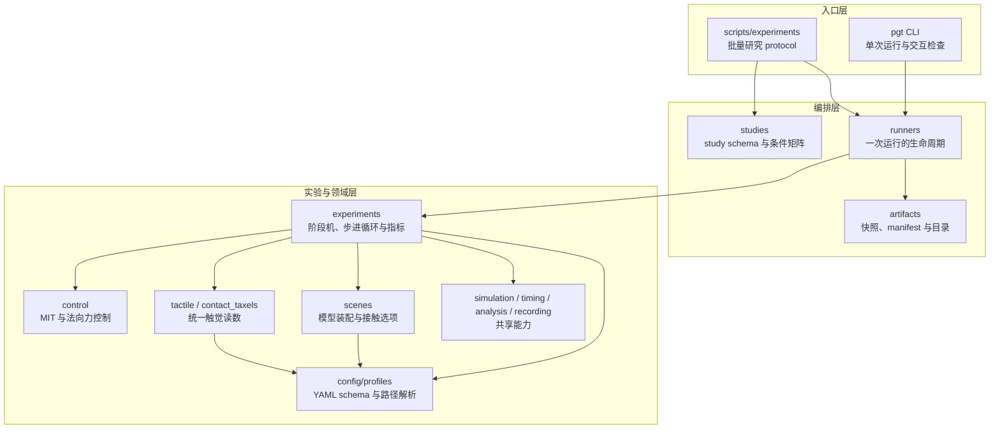
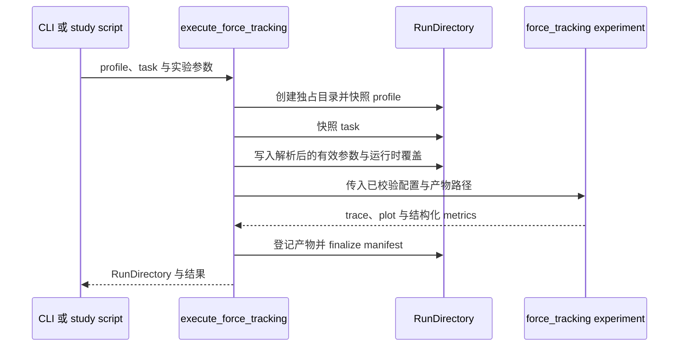

# 🏗️ 项目架构

项目把“单次可复现实验”和“多条件科研 protocol”分开：`pgt` 面向交互式单次运行，
`scripts/experiments` 面向批量研究；二者通过 Python runner 复用同一套实验实现和运行产物约定。



箭头表示调用或配置依赖，不表示每个模块都必须经过图中的所有节点。例如，轻量的静态查看命令可以
直接装配 scene；需要保存结果的力跟踪则由 runner 统一创建目录、调用 experiment、登记产物并完成
manifest。

## 模块职责

| 区域 | 主要职责 | 不应承担的职责 |
| --- | --- | --- |
| `config/profiles.py` | 用冻结的 Pydantic 模型校验 YAML，并以 YAML 所在目录解析相对路径；`profiles.py` 仅保留兼容导出 | 启动 MuJoCo 或写运行结果 |
| `artifacts/` | 管理运行目录、输入快照、manifest 与安全清理；`run_artifacts.py` 仅保留兼容导出 | 推进仿真或决定实验控制逻辑 |
| `analysis/` | 读取触觉力轨迹并提供基础分析；原 `analysis` 导入路径由同名包兼容 | 设定论文样式或改变实验数据口径 |
| `visualization/` | 提供论文绘图样式与摩擦检测图；`plotstyle.py`、`friction_plots.py` 仅保留兼容导出 | 读取控制状态或重新计算实验指标 |
| `scenes/` | 装配 MJCF、物体材料、碰撞几何和求解选项 | 控制算法、指标统计 |
| `tactile.py`、`contact_taxels.py` | 把不同后端统一为局部 `(3, rows, cols)` 力数组 | 决定目标力或控制状态 |
| `force_scheduling.py` | 由切向载荷和摩擦系数生成受限的平均单侧目标力 | 读取 MuJoCo 状态或直接写执行器 |
| `packages/robotiq_grasp_core` | 在整数命令空间执行稳定判定、单 tick 增益估计、HOLD 与安全动作决策；`discrete_force_control.py` 保留兼容导出 | 推进仿真、读取 oracle 刚度或依赖 DM 控制核 |
| `perception/slip.py` | 仅由触觉时序生成变化评分，持续确认后冻结摩擦候选；`tactile_slip.py` 保留兼容导出 | 读取外部载荷、探测命令、真值 `μ` 或物体运动 |
| `perception/friction.py` | 保留历史估计器和估计结果结构；`friction_estimation.py` 保留兼容导出 | 被当前实验实例化以使用残差检测 |
| `perception/taxels.py` | 筛选逐 taxel 接触，并用局部摩擦比趋势和剪切重分配生成纯力局部起滑候选；`taxel_friction.py` 保留兼容导出 | 把未验证的局部候选直接用于目标力调度 |
| `control.py` | 接触状态、力语义、MIT 命令与法向力外环 | 创建输出目录或解析 CLI |
| `experiments/` | 定义阶段机、仿真循环、trace 字段和指标 | 组织跨条件批量研究 |
| `runners/` | 管理一次运行的输入快照、experiment 调用、产物登记和失败保留 | 展示 Rich 表格或展开 study 矩阵 |
| `studies/` | 定义可校验的研究配置与条件矩阵 | 通过子进程调用 CLI |
| `scripts/experiments/` | 执行 study、聚合多次结果 | 复制单次实验物理逻辑 |
| `cli/` | 参数适配、面向人的诊断和结果展示 | 作为包内模块的反向依赖 |

## 仿真循环所有权

任一实验运行中只能有一个组件推进对应的 `MjData`。`SimulationSession` 提供物理、控制与采样时钟
解耦的通用循环；力跟踪、抓取验收、录制和对比实验因各自的阶段机、双模型同步或 viewer 节奏而持有
专用循环。它们遵守相同的不变量：控制发生在物理步之前，测量发生在物理步之后，并且控制周期不得小于
MuJoCo 物理步长。

## 触觉与碰撞边界

触觉读取器返回局部 `(3, rows, cols)` 数组，正 `Fz` 表示压缩。控制器只消费统一后的
`F_L`、`F_R` 与平均单侧法向力 `f_n=(F_L+F_R)/2`，不依赖 Pillar 是 mesh 还是球体。

Pillar 碰撞几何属于 asset/profile，`scenes.custom` 负责把它装配进实验，并可为诊断切换
`multiccd`。碰撞近似的当前默认、五条件因果对照与适用范围见
[触觉读数约定](tactile-conventions.md#collision-geometry-conclusions)。

## 运行产物流



单次结果目录的典型结构为：

```text
outputs/<profile>/<experiment>/<UTC timestamp>-<id>/
├── manifest.json
├── profile.yaml
├── task.yaml        # 仅需要 task 的实验
├── effective_parameters.json  # 任务实验：完整解析结果与实际覆盖
├── trace.parquet
├── trace.csv       # discrete-force、force-schedule 与 friction-estimate
├── metrics.json
├── plot.png
├── plot.pdf
└── video.mp4        # 仅请求录制时
```

人工输入的 profile、task 与 study 保持 YAML，便于审阅和版本管理。每个 force-track run 额外写入
`effective_parameters.json`，其中包含解析后的完整 profile、task 和实际运行时覆盖；它是复现运行语义的
权威机器可读快照。默认 `trace.parquet` 使用 Zstd 压缩和事件感知降采样：普通控制器常规区段为
100 Hz，直接力矩 ADRC 为 250 Hz，状态切换和 waypoint 邻域保留完整控制频率。指标与绘图读取内存中的
完整频率 trace，因此存储优化不改变实验结论。旧 CSV API 与历史 `trace.csv` 仍可读取。

`metrics.json` 与 `manifest.json` 继续使用 JSON。`manifest.json` 只列出实际生成并登记的文件，同时记录
profile 哈希、Git 状态、依赖版本、参数和创建时间。失败的运行目录会保留输入快照，便于复现诊断。

study 在单次运行之上增加一层父目录；每个条件仍使用相同 runner：

```text
outputs/studies/<study>/<UTC timestamp>-<id>/
├── study.yaml
├── study.resolved.json
├── runs/
│   └── <profile>/force-track/<condition>-<UTC timestamp>-<id>/
├── summary.csv
├── summary.parquet
├── summary.json            # 保留兼容的结构化汇总
├── aggregate.csv         # 需要跨重复统计的批量研究提供
├── aggregate.parquet     # 需要跨重复统计的批量研究提供
├── figures/              # study 级跨条件对比图
│   ├── metrics_by_controller.png
│   ├── metrics_by_controller.pdf
│   ├── saturation_comparison.png
│   ├── saturation_comparison.pdf
│   ├── ablation_delta.png
│   ├── ablation_delta.pdf
│   ├── tracking_<task>_<material>.png
│   └── tracking_<task>_<material>.pdf
└── study_manifest.json   # 登记子 run 与 study 级产物
```

study 的 `summary` 与（适用时的）`aggregate` 同时输出 CSV 和 Parquet；diagnosis study 只输出 summary，
不生成 aggregate。单次 run 的 `plot.png` / `plot.pdf` 由 experiment 从本次完整频率 trace 生成，并根据
Step、Ramp、Mixed/Smoothstep 任务分别突出瞬态、滞后和 waypoint 误差；跨 run 的统计图由
`scripts/experiments` 在所有条件结束后从 `summary`、`aggregate` 和子 run trace 生成 600 DPI PNG 与
矢量 PDF，并登记到 `study_manifest.json`。未建立 `track_reference` 的条件会在 summary 与 manifest 的 `failed_runs` 中保留，
但不会参与同 seed 轨迹叠加。绘图层不推进 MuJoCo，也不重新计算控制命令。

## 依赖规则

DMgripper 的二阶导纳基线另由 `packages/dm_grasp_core` 独立包提供，与 ROS 2 共用；
包内按 `control`、`grasp` 与 `tactile` 子域组织，同时保留旧导入路径。
`dm_admittance.py` 只负责把共享算法接入 MuJoCo；既有 PID/ADRC 暂保留历史实现。
共享核无 ROS、MuJoCo 或 profile 依赖，安装 ROS 侧时不需要安装仿真主包。
导纳外环按任务周期生成 MIT 请求，执行器适配每个物理步用最新 q/dq 重算内环力矩，
模拟电机内部持续执行目标。此路径不改变旧实验的控制时序。详情见
[DMgripper 共享控制核](dm-shared-control.md)。

Robotiq 离散力控制由独立 workspace 成员 `packages/robotiq_grasp_core` 提供；仿真主包通过
兼容模块接入。该核心仅依赖 NumPy，不依赖 ROS、MuJoCo、profile、DM 核或仿真主包。
DM 与 Robotiq 分别维护控制算法、命令类型和状态机。

纯 Python 真机基础层同样按夹爪隔离。`packages/dmgripper_hardware` 提供 DM4310P
USB2CAN 协议、传输、状态刷新和当前夹爪部署边界；`packages/robotiq_hardware` 提供 `0～255`
位置命令边界与 `pyrobotiqgripper==3.3.12` 薄适配。两包互不依赖，也不依赖仿真主包。
`packages/papillarray_hardware` 是独立的商业触觉设备包，只负责 PTS v2.0 解析、同步串口读取和
显式设备命令；实验运行时把它与所选夹爪后端组合，不让共享采集代码变成共享控制逻辑。
所有设备对象均要求显式打开或调用才发生 I/O，当前不会自动连接、激活或驱动执行器。
DM 核心命令经显式适配后才进入协议量化；Robotiq 硬件单步只调用自身离散控制核心，且仅在
位置命令成功交给后端后登记动作。两条适配链不共享命令类型或控制时序；USB2CANFD 仍待实物
到位后按实际接口新增传输后端。

1. `src/parallel_gripper_tactile` 不依赖 `scripts/` 或 CLI 输出格式；
2. study 直接调用 runner，不通过子进程拼接 `pgt` 命令；
3. scene 不读取控制目标，controller 不选择碰撞 asset；
4. experiment 返回结构化结果，入口层决定如何展示；
5. 任何新增结果文件必须先写入独占 run 目录，再登记到 manifest。

## 科研绘图公共层

`visualization/plotstyle.py` 只负责样式、物理尺寸与文件导出，不处理实验数据和统计。
`science_pyplot()` 注册 SciencePlots 并应用统一中英文字体；`paper_figsize()` 提供单栏和跨栏宽度；
`save_publication_figure()` 保存同名 PDF 与 PNG，保留画布尺寸并由调用方关闭图像。
实验入口负责面板组织、标签与图例，runner 或 CLI 负责产物登记。视频叠加面板不属于论文图。
