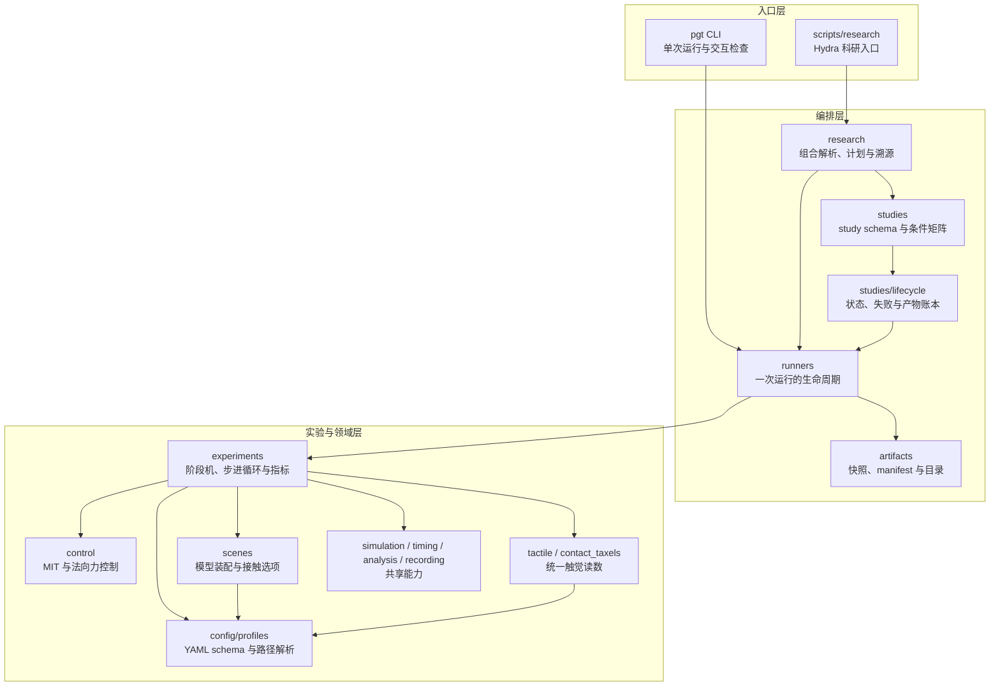
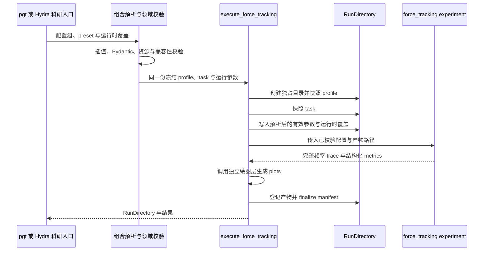

# 🏗️ 项目架构

项目把演示/检查、科研组合和正式研究分开：`pgt` 面向交互运行，`scripts/research/run.py` 面向
Hydra 单次与探索性 Multirun，`scripts/research/study.py` 面向固定矩阵的正式研究；它们通过 Python
runner 复用同一套实验实现和运行产物约定。旧研究脚本已移除，避免绕过统一组合解析。



箭头表示调用或配置依赖，不表示每个模块都必须经过图中的所有节点。例如，轻量的静态查看命令可以
直接装配 scene；需要保存结果的力跟踪则由 runner 统一创建目录、调用 experiment、登记产物并完成
manifest。

## 模块职责

| 区域 | 主要职责 | 不应承担的职责 |
| --- | --- | --- |
| `config/profiles.py` | 校验最终冻结的 Pydantic profile；兼容旧完整 YAML 的相对资源路径解析 | 选择配置组、启动 MuJoCo 或写运行结果 |
| `research/configuration.py` | 将 platform、model、controller、estimator、task、material、execution 与 experiment 片段组合为冻结领域对象 | 推进仿真或让 runner 重读片段 |
| `artifacts/` | 管理运行目录、输入快照、manifest 与安全清理 | 推进仿真或决定实验控制逻辑 |
| `analysis/` | 读取触觉力轨迹并提供基础分析；原 `analysis` 导入路径由同名包兼容 | 设定论文样式或改变实验数据口径 |
| `visualization/` | 提供论文绘图样式与摩擦检测图 | 读取控制状态或重新计算实验指标 |
| `scenes/` | 装配 MJCF、物体材料、碰撞几何和求解选项 | 控制算法、指标统计 |
| `tactile.py`、`contact_taxels.py` | 把不同后端统一为局部 `(3, rows, cols)` 力数组 | 决定目标力或控制状态 |
| `force_scheduling.py` | 由切向载荷和摩擦系数生成受限的平均单侧目标力 | 读取 MuJoCo 状态或直接写执行器 |
| `packages/robotiq_grasp_core` | 在整数命令空间执行稳定判定、单 tick 增益估计、HOLD 与安全动作决策 | 推进仿真、读取 oracle 刚度或依赖 DM 控制核 |
| `perception/slip.py` | 仅由触觉时序生成变化评分，持续确认后冻结摩擦候选 | 读取外部载荷、探测命令、真值 `μ` 或物体运动 |
| `perception/friction.py` | 保留历史估计器和估计结果结构 | 被当前实验实例化以使用残差检测 |
| `perception/taxels.py` | 筛选逐 taxel 接触，并用局部摩擦比趋势和剪切重分配生成纯力局部起滑候选 | 把未验证的局部候选直接用于目标力调度 |
| `control.py` | DM 力控的仿真适配层：MIT 执行器绑定、profile 到核心配置转换与公共名称再导出；算法本体在 `dm_grasp_core.control` | 改变算法数值行为或让本层重新实现控制律 |
| `experiments/` | 定义阶段机、仿真循环、trace 字段和指标 | 组织跨条件批量研究 |
| `runners/` | 管理一次运行的输入快照、experiment 调用、产物登记和失败保留 | 展示 Rich 表格或展开 study 矩阵 |
| `research/` | 把 Hydra 组合解析为冻结领域配置，执行计划/运行并记录组合溯源 | 维护控制算法或设备 I/O |
| `studies/` | 定义可校验的研究配置、唯一条件矩阵、公共生命周期与可复用 protocol | 通过子进程调用 CLI，或统一任务／控制器／统计公式 |
| `scripts/research/` | 提供轻薄的 Hydra 原生科研入口 | 复制 runner、矩阵或实验物理逻辑 |
| `cli/` | 参数适配、面向人的诊断和结果展示 | 作为包内模块的反向依赖 |

正式研究的入口适配在 `research/study.py` 的 `_STUDY_ADAPTERS` 显式登记：每个研究类型关联
领域 schema、需要规范的路径字段、预检函数和 protocol。新增研究时登记一次适配关系，并验证对应配置
可建计划、执行仍接收同一 `StudyPlan`；不再分别扩展解析、计划和执行的类型分支。
普通研究先预检再建计划；Torque 调参仍先由 protocol 校验 coarse／confirm 谱系并生成候选计划，
再按实际候选预检。诊断的 phase 和速率确认的研究身份继续显式传给原协议。

## 仿真循环所有权

任一实验运行中只能有一个组件推进对应的 `MjData`。`SimulationSession` 提供物理、控制与采样时钟
解耦的通用循环；力跟踪、抓取验收、录制和对比实验因各自的阶段机、双模型同步或 viewer 节奏而持有
专用循环。它们遵守相同的不变量：控制发生在物理步之前，测量发生在物理步之后，并且控制周期不得小于
MuJoCo 物理步长。

## 触觉与碰撞边界

触觉读取器返回局部 `(3, rows, cols)` 数组，正 `Fz` 表示压缩。控制器只消费统一后的
`F_L`、`F_R` 与平均单侧法向力 `f_n=(F_L+F_R)/2`，不依赖 Pillar 是 mesh 还是球体。

Pillar 碰撞几何属于 asset/profile，`scenes.custom` 负责把它装配进实验，并可为诊断切换
`multiccd`。碰撞近似的当前默认、五条件因果对照与适用范围见
[触觉读数约定](tactile-conventions.md#collision-geometry-conclusions)。

## 运行产物流



单次结果目录的典型结构为：

```text
outputs/<profile>/<experiment>/<UTC timestamp>-<id>/
├── manifest.json
├── profile.yaml
├── task.yaml        # 仅需要 task 的实验
├── effective_parameters.json  # 任务实验：完整解析结果与实际覆盖
├── trace.parquet
├── trace.csv       # discrete-force、force-schedule 与 friction-estimate
├── metrics.json
├── plot.png         # 其他实验的单次图
├── plots/           # force-track 的单次图
│   ├── tracking.png
│   ├── tactile.png      # 诊断模式或科学失败
│   └── controller.png   # 诊断模式或科学失败
└── video.mp4        # 仅请求录制时
```

人工输入的 profile、task 与 study 保持 YAML，便于审阅和版本管理。每个 force-track run 额外写入
`effective_parameters.json`，其中包含解析后的完整 profile、task 和实际运行时覆盖；它是复现运行语义的
权威机器可读快照。默认 `trace.parquet` 使用 Zstd 压缩和事件感知降采样：普通控制器常规区段为
100 Hz，直接力矩 ADRC 为 250 Hz，状态切换和 waypoint 邻域保留完整控制频率。指标与绘图读取内存中的
完整频率 trace，因此存储优化不改变实验结论。旧 CSV API 与历史 `trace.csv` 仍可读取。

`metrics.json` 与 `manifest.json` 继续使用 JSON。`manifest.json` 只列出实际生成并登记的文件，同时记录
profile 哈希、Git 状态、依赖版本、参数和创建时间。组合入口的 `profile.yaml` 与 `task.yaml` 直接序列化
实际执行使用的同一冻结对象，避免把 platform 或 task 组包装误作完整输入。失败的运行目录会保留输入快照，
便于复现诊断。

Hydra 拥有科研调用的外层目录和组合溯源，`RunDirectory` 拥有内部实验产物。study 在单次运行之上
增加一层父目录；每个条件仍使用相同 runner：

```text
outputs/research/studies/<study>/<UTC timestamp>-<id>/
├── study.yaml
├── study.resolved.json
├── runs/
│   └── <profile>/force-track/<condition>-<UTC timestamp>-<id>/
├── summary.csv
├── summary.parquet
├── summary.json            # 保留兼容的结构化汇总
├── aggregate.csv         # 需要跨重复统计的批量研究提供
├── aggregate.parquet     # 需要跨重复统计的批量研究提供
├── figures/              # study 级跨条件对比图
│   ├── metrics_by_controller.png
│   ├── saturation_comparison.png
│   ├── ablation_delta.png
│   └── tracking_<task>_<material>.png
└── study_manifest.json   # 登记子 run 与 study 级产物
```

study 的 `summary` 与（适用时的）`aggregate` 同时输出 CSV 和 Parquet；diagnosis study 只输出 summary，
不生成 aggregate。单次 force-track run 由 runner 的 `on_result(full_rows, result)` 回调调用纯绘图层，
从本次完整频率 trace 按出图模式生成单次图并登记实际文件；跨 run 的统计图由
包内 study protocol 在所有条件结束后从 `summary`、`aggregate` 和子 run trace 生成 600 DPI PNG，
并登记到 `study_manifest.json`。公共生命周期持有同一个有序 `StudyPlan`，在执行前写入
`running` 状态；`execution.workers>1` 时以 `spawn` 进程并行运行独立条件，父进程在每个条件完成后
按计划顺序更新账本，并独占聚合与绘图。最终状态为 `partial`、`completed` 或 `failed`。正常完成但
`passed=false` 的条件记录为 `scientific_failure`，形成不了 run 的 Python 异常记录为
`execution_error`；聚合和绘图异常独立登记。未建立 `track_reference` 的正常条件会在 summary 与
manifest 的 `failed_runs` 中保留，
但不会参与同 seed 轨迹叠加。绘图层不推进 MuJoCo，也不重新计算控制命令。

`StudyPlan` 的科学哈希覆盖领域配置、有序条件、控制器完整默认值、输入资源内容、材料／seed 及
统计和阶段规则，同时排除时间、cwd 和输出目录。Torque ADRC confirm 额外把 coarse 科学哈希与排名
产物摘要纳入谱系。恢复接口只读分析兼容 manifest 和可重试条件，当前不自动跳过 run 或跨配置聚合。

## 依赖规则

DMgripper 的二阶导纳基线另由 `packages/dm_grasp_core` 独立包提供，与 ROS 2 共用；
包内按 `control`、`grasp` 与 `tactile` 子域组织，同时保留旧导入路径。
`dm_admittance.py` 只负责把共享算法接入 MuJoCo；既有 PID/ADRC 暂保留历史实现。
`dm-grasp-core` 的公共双侧接触状态机可由 PID 与导纳共同使用，统一入口据此共享接近、接触确认、
速度过渡和掉力重接近语义；未显式选择该状态机的历史实验保持原阶段行为。
共享核无 ROS、MuJoCo 或 profile 依赖，安装 ROS 侧时不需要安装仿真主包。
导纳外环按任务周期生成 MIT 请求，执行器适配每个物理步用最新 q/dq 重算内环力矩，
模拟电机内部持续执行目标。此路径不改变旧实验的控制时序。详情见
[DMgripper 共享控制核](dm-shared-control.md)。

Robotiq 离散力控制由独立 workspace 成员 `packages/robotiq_grasp_core` 提供；仿真主包直接依赖该 workspace 成员。该核心仅依赖 NumPy，不依赖 ROS、MuJoCo、profile、DM 核或仿真主包。
DM 与 Robotiq 分别维护控制算法、命令类型和状态机。

纯 Python 真机基础层同样按夹爪隔离。`packages/dmgripper_hardware` 提供 DM4310P
USB2CAN 协议、传输、状态刷新和当前夹爪部署边界；`packages/robotiq_hardware` 提供 `0～255`
位置命令边界与 `pyrobotiqgripper==3.3.12` 薄适配。两包互不依赖，也不依赖仿真主包。
`packages/papillarray_hardware` 是独立的商业触觉设备包，只负责 PTS v2.0 解析、同步串口读取和
显式设备命令；实验运行时把它与所选夹爪后端组合，不让共享采集代码变成共享控制逻辑。
纯 Python 真机实验由夹爪专属的组合包承载：`dmgripper_experiments` 可依赖
`dmgripper_hardware`、`papillarray_hardware` 和 DM 控制核，但不得依赖 Robotiq 硬件或控制核。
它只负责试验流程、设备调度、时间对齐与记录，不定义新的 MIT 或触觉控制公式。
后续 `robotiq_experiments` 以相同层次单独组合 Robotiq 链路；两者不共享命令类型、
控制状态机或调度周期。
所有设备对象均要求显式打开或调用才发生 I/O，当前不会自动连接、激活或驱动执行器。
`papillarray-probe` 只配置采样率并输出有限个触觉包；`dmgripper-state-probe` 只发送状态查询帧。
两者用于分别核对数据链路，均不是闭环运行时、安全互锁或急停实现。
DM 核心命令经显式适配后才进入协议量化；Robotiq 硬件单步只调用自身离散控制核心，且仅在
位置命令成功交给后端后登记动作。两条适配链不共享命令类型或控制时序；USB2CANFD 仍待实物
到位后按实际接口新增传输后端。

1. `src/parallel_gripper_tactile` 不依赖 `scripts/` 或 CLI 输出格式；
2. study 直接调用 runner，不通过子进程拼接 `pgt` 命令；
3. scene 不读取控制目标，controller 不选择碰撞 asset；
4. experiment 返回结构化结果，入口层决定如何展示；
5. 任何新增结果文件必须先写入独占 run 目录，再登记到 manifest。
6. 正式 study 的条件只由领域 protocol 展开；计划与执行必须共享同一个 `StudyPlan`，Hydra 外层不得再次展开。

Hydra 与 OmegaConf 属于主包运行依赖，供 CLI 与科研入口共用 `research/` 组合服务。共享 DM/Robotiq 控制核、硬件基础包
和夹爪专属真机组合包均不依赖 Hydra 或仿真主包。科研配置解析可以读取、校验和编译模型，但不会创建
设备连接或发送命令。完整的配置组、路径和目录所有权见
[Hydra 科研配置与实验编排](research-configuration.md)。

上述规则中可表达为 import 依赖的部分（分层方向、规则 1／3／4 的包边界、共享包独立性）由
import-linter 契约机器检查：配置位于 `pyproject.toml` 的 `[tool.importlinter]`，可用
`uv run lint-imports` 单独执行，并由 `tests/test_architecture_contracts.py` 并入裸 pytest 门禁。
规则 2 与规则 5 涉及运行行为与产物登记时序，仍由评审与 runner 实现保证。

## 科研绘图公共层

`visualization/plotstyle.py` 只负责样式、物理尺寸与文件导出，不处理实验数据和统计。
`science_pyplot()` 注册 SciencePlots 并应用统一中英文字体；`paper_figsize()` 提供单栏和跨栏宽度；
`save_publication_figure()` 只按调用方请求的扩展名保存一份图像，保留画布尺寸并由调用方关闭图像。
实验入口负责面板组织、标签与图例，runner 或 CLI 负责产物登记。视频叠加面板不属于论文图。

force-track 单次绘图层位于 `visualization/force_tracking.py`：默认 summary 模式只输出跟踪主图，
diagnostic 模式输出完整诊断；科学失败自动保留诊断。图像为 600 DPI PNG，不自动生成 PDF。
`tracking.png` 为目标力 `F_ref` 与滤波力 `F_filt`（缺失时回退 `meas`）单面板；`tactile.png`
展示左右法向力 `F_{nL}`／`F_{nR}` 与切向模长 `F_{tL}`／`F_{tR}`；`controller.png` 展示
`q_des`／`q`、`dq_des`／`dq`、命令力矩 `tau_cmd` 与 MuJoCo 执行力矩 `tau_act`，并按有效数据
增加 `K_hat`、导纳 `x_a`／`dx_a`、ADRC 扰动和位置修正分解。坐标轴使用带单位的 MathText 标签
（例如 `t (s)`），关键接触事件用细灰色竖线；waypoint 仅在线性参考曲线上使用 marker，不绘制
事件竖线。默认不含误差、滞回、limits 或 state 面板。
