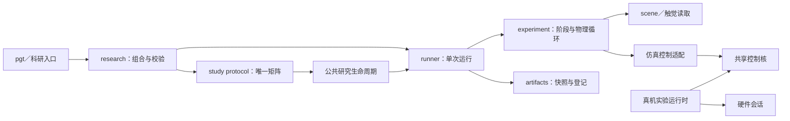

# 项目架构

仿真入口通过组合解析、runner 和实验内核完成运行；真机由独立硬件实验包组合设备会话与共享控制核。

静态查看可直接装配 scene。共享算法不负责设备访问、物理步进或实验生命周期。

## 模块职责

| 区域 | 主要职责 | 不应承担的职责 |
| --- | --- | --- |
| `config/profiles.py` | 校验最终冻结的 Pydantic profile；解析资源相对路径 | 选择配置组、启动 MuJoCo 或写运行结果 |
| `research/configuration.py` | 将 platform、model、controller、estimator、task、material、execution 与 experiment 片段组合为冻结领域对象 | 推进仿真或让 runner 重读片段 |
| `artifacts/` | 管理运行目录、输入快照、manifest 与安全清理 | 推进仿真或决定实验控制逻辑 |
| `analysis/` | 读取触觉力轨迹并提供基础分析 | 设定论文样式或改变实验数据口径 |
| `visualization/` | 提供论文绘图样式与摩擦检测图 | 读取控制状态或重新计算实验指标 |
| `scenes/` | 装配 MJCF、物体材料、碰撞几何和求解选项 | 控制算法、指标统计 |
| `tactile.py`、`contact_taxels.py` | 把不同后端统一为局部 `(3, rows, cols)` 力数组 | 决定目标力或控制状态 |
| `force_scheduling.py` | 由切向载荷和摩擦系数生成受限的平均单侧目标力 | 读取 MuJoCo 状态或直接写执行器 |
| `tangential_disturbance.py` | 保留 Pydantic 仿真配置兼容，并再导出共享的纯触觉增力策略 | 估计摩擦系数或证明微滑移 |
| `packages/robotiq_grasp_core` | 在整数命令空间执行稳定判定、单 tick 增益估计、HOLD 与安全动作决策 | 推进仿真、读取 oracle 刚度或依赖 DM 控制核 |
| `perception/slip.py` | 仅由触觉时序生成变化评分，持续确认后冻结摩擦候选 | 读取外部载荷、探测命令、真值 `μ` 或物体运动 |
| `perception/taxels.py` | 筛选逐 taxel 接触，并用局部摩擦比趋势和剪切重分配生成纯力局部起滑候选 | 把未验证的局部候选直接用于目标力调度 |
| `control.py` | DM 力控的仿真适配层：MIT 执行器绑定、profile 到核心配置转换与公共名称再导出；算法本体在 `dm_grasp_core.control` | 改变算法数值行为或让本层重新实现控制律 |
| `experiments/` | 定义阶段机、仿真循环、trace 字段和指标 | 组织跨条件批量研究 |
| `runners/` | 管理一次运行的输入快照、experiment 调用、产物登记和失败保留 | 展示 Rich 表格或展开 study 矩阵 |
| `research/` | 把 Hydra 组合解析为冻结领域配置，执行计划/运行并记录组合溯源 | 维护控制算法或设备 I/O |
| `studies/` | 定义可校验的研究配置、唯一条件矩阵、公共生命周期与可复用 protocol | 通过子进程调用 CLI，或统一任务／控制器／统计公式 |
| `scripts/research/` | 提供轻薄的 Hydra 原生科研入口 | 复制 runner、矩阵或实验物理逻辑 |
| `cli/` | 参数适配、面向人的诊断和结果展示 | 作为包内模块的反向依赖 |

正式研究在 `research/study.py` 的 `_STUDY_ADAPTERS` 登记 schema、路径规范、预检函数和
protocol；计划与执行持有同一 `StudyPlan`。Torque 调参先校验谱系并生成候选，再按候选预检。

## 模型资产与文档边界

`assets/grippers/robotiq_2f85` 与 `assets/grippers/dm_gripper` 分别拥有模型、网格、
模型专属触觉布局和生成说明。主包读取器负责转换成[公共触觉接口](tactile-conventions.md)，
控制核消费规范化数值；具体生成工具的现有位置与资产独立性验收标准见[资产维护约定](#asset-maintenance)。

资产正文在 `assets/` 下维护，站点主题页通过 `pymdownx.snippets` 引用同一正文片段。
主题页维护阅读路线与站点链接映射，不复制资产正文；运行时不读取文档或依赖站点构建。

--8<-- "assets/README.md:maintenance"

[testing]: testing.md

## 仿真循环所有权

任一实验运行中只能有一个组件推进对应的 `MjData`。`SimulationSession` 提供物理、控制与采样时钟
解耦的通用循环；力跟踪、抓取验收、录制和对比实验因各自的阶段机、双模型同步或 viewer 节奏而持有
专用循环。它们遵守相同的不变量：控制发生在物理步之前，测量发生在物理步之后，并且控制周期不得小于
MuJoCo 物理步长。

## 触觉与碰撞边界

触觉读取器返回局部 `(3, rows, cols)` 数组，正 `Fz` 表示压缩。控制器只消费统一后的
`F_L`、`F_R` 与平均单侧法向力 `f_n=(F_L+F_R)/2`，不依赖 Pillar 是 mesh 还是球体。

Pillar 碰撞几何属于 asset/profile，`scenes.custom` 负责把它装配进实验，并可为诊断切换
`multiccd`。碰撞近似的当前默认、五条件因果对照与适用范围见
[模型与测量验证](control-comparison-ablation.md#collision-geometry-conclusions)。

## 运行产物流

1. 组合服务校验并冻结 profile、task 与运行参数；runner 不重读原始片段。
2. runner 创建独占目录，保存输入快照与有效参数，再调用 experiment。
3. experiment 返回 trace 与指标；绘图层处理结果，不推进仿真或重算控制命令。
4. runner 登记实际产物并完成 manifest；失败也保留输入和异常信息。
5. study protocol 唯一生成矩阵；公共生命周期处理状态、失败、聚合与登记，不改变科学口径。

Hydra 拥有调用外层目录和组合来源，`RunDirectory` 拥有单次实验目录。研究的目录、哈希、失败分类、
并行与恢复规则见[科研配置](research-configuration.md)，各实验的 trace 与指标见对应专题。

## 共享核与硬件边界

DM 的 PID、ADRC、导纳、刚度估计、运动学、目标曲线与触觉增力由 `dm_grasp_core` 提供纯计算。
`dm_grasp_core.grasp.adaptive` 提供固定分侧摩擦先验的承载需求与连续单调增力，
由目标力调度仿真实验适配实测切向力；不读取场景重量、真实摩擦或外加载荷。
`grasp.unified` 组合 `tactile.risk` 的逐触点观测、分侧摩擦状态和受限目标调度；
仿真、真机与旁路回放共用计算与诊断字段，运行时仍各自拥有生命周期和故障保护。
仿真 `control.py`／`dm_admittance.py` 负责配置与执行器适配，真机运行时负责设备生命周期。
两层控制周期、请求量化和验证边界见[DMgripper 共享控制核](dm-shared-control.md)。

### 多速率触觉与控制边界

`dm_grasp_core.tactile.multirate` 提供纯数值 `TactilePreprocessor`、不可变 `TactileState`
和只交换引用的 `LatestTactileBuffer`。生产者独占切向分量中值、承载低通和风险观察器；
消费者独占 `UnifiedAdaptivePolicy` 的目标调度、执行约束与控制器状态。采样侧不能调用完整
调度 `update()`，否则会把控制积分频率也升高；控制侧调用 `update_tactile_state()` 消费已滤波承载，
不再次施加承载低通。法向反馈继续使用控制器原有滤波，不与切向滤波共用参数。

首个接入后端是力调度仿真：物理循环独占 `MjData`，独立采样时钟在每个应到的物理状态上产生快照，
随后控制时钟读取最新快照并更新目标／MIT 请求。500 Hz 采样、250 Hz 控制时，控制序号正常跨两个采样；
不能把这一正常抽取当成传感器丢帧。物理步仍重算保持请求的 MIT 合成力矩，模拟电机内环。
风险和摩擦默认旁路，可显式开放。快照在新鲜度窗口内锁存最近事件及候选，
接触变化、坏帧和间断撤销锁存；消费者按事件编号去重，续增不得冒充独立摩擦证据。
高频日志保留逐事件候选，控制日志记录累计事件编号，不能用瞬时布尔量代替事件交付。

真机通过显式 `reference.adaptive.tactile_sampling` 接入：硬件采集器提供可选快照转换回调，
实验层 `HardwareTactilePreprocessor` 在采集线程处理完整包，并一次发布包含原始／预处理状态的
`MultirateSnapshot`；硬件协议包不依赖抓取策略。设备时间用于滤波，主机单调接收时间用于新鲜度，
控制侧只将已完成滤波的快照时间映射为接收时间，不用设备时间与主机时间直接相减。
采集侧原始过力／逐触点量程异常先于中值处理，异常在采集线程锁存，运行时仍按统一模式失能。
当前同步日志写入与串口吞吐仍需设备侧验证；软件接入不保证实测 500 Hz 或硬实时 deadline。

重复或短期陈旧快照不允许目标增长，恢复时不补算历史增力；持续无效沿用统一策略失败超时。
非法或超量程帧不能被中值滤波隐藏，缓冲必须发布无效状态而不是继续展示旧好帧。
快照还保留累计坏帧计数，即使中间坏帧在下个控制 tick 前被好帧覆盖，消费者仍冻结该次增力并记录无效观测。
新核心只报告状态，不决定保持或失能；真机统一模式的非法数据／硬超时失能规则保持不变。

| 包 | 拥有的职责 | 不拥有的职责 |
| --- | --- | --- |
| `papillarray_hardware` | PapillArray 串口与 PTS v2.0 协议、原始包、bias 基础命令、可复用采集会话，以及包级、传感器级和逐 taxel 完整性诊断 | 接触、预载、零力是否通过、实验阶段、运行目录或 manifest |
| `dmgripper_hardware` | USB2CAN 与 DM 协议、反馈状态与命令／反馈范围校验，以及显式 `open`、`inspect`、`require_disabled`、`enable`、`command`、`hold`、`disable`、`close` 会话 | 自动回零、实验故障分类、何时保持或释放、实验记录 |
| `dm_grasp_core` | 曲柄滑块运动学、受限轨迹与 MIT 请求，以及导纳、PID、LADRC 和刚度估计等纯计算 | 设备访问、实验生命周期和文件记录 |
| `dmgripper_experiments` | 冻结配置、人工命令、零力门禁、接触／预载／动态任务、自动回零、故障分类与故障保持，以及 `config.json`、`events.jsonl`、`tactile.jsonl`、`trace.csv`、manifest 和绘图 | 重新实现 PTS、USB2CAN、DM 协议或共享控制公式 |

Robotiq 使用独立的 `robotiq_grasp_core` 与 `robotiq_hardware`，不与 DM 共用命令类型或控制状态机。
Robotiq 的可选 `robotiq-teleop` 入口通过显式启动的单线程会话连接 USB／RS485，
鼠标／手柄只提交输入，不直接访问串口；它不接入触觉或实验闭环。基础位置后端契约不变。
硬件对象构造不发生 I/O；连接、使能与动作必须显式调用。DM 真机入口与故障处理见
[DMgripper 通用抓取实验](dmgripper-experiments.md)。

## 依赖规则

- 主包不依赖 `scripts/` 或 CLI 输出；study 直接调用 runner，不启动 CLI 子进程。
- scene 不读取控制目标，controller 不选择碰撞资产；experiment 返回结构化结果，由入口展示。
- 新产物先写入独占目录，再登记 manifest；不同条件不写共享输出。
- 矩阵只由领域 protocol 展开，Hydra 外层不得再次展开；科学失败、执行异常与阶段谱系分别保留。
- Hydra／OmegaConf 属于主包运行依赖，供组合服务使用；共享核、硬件基础包与真机实验包不依赖仿真主包。

导入边界由 `pyproject.toml` 的 import-linter 契约及 `tests/test_architecture_contracts.py` 检查；
运行时调用与产物登记仍需行为测试和评审。

## 科研绘图公共层

`visualization/plotstyle.py` 只负责样式、尺寸与导出。`science_pyplot()` 配置统一字体，
`paper_figsize()` 提供论文栏宽，`save_publication_figure()` 按请求格式保存并由调用方关闭图像。
实验绘图层组织面板与标签，runner／study 登记产物；出图选择见
[科研出图模式](research-configuration.md#plot-modes)，验证要求见[测试策略](testing.md)。
