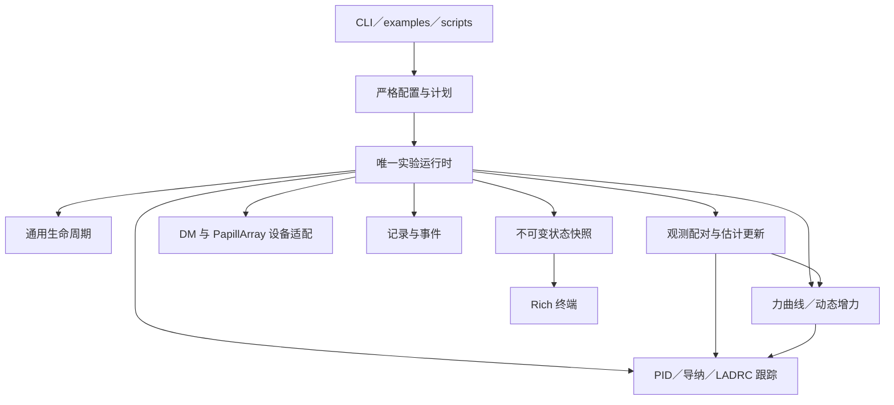

# DMgripper 通用抓取实验重构实施计划

状态：待实施。编写日期：2026-09-13。源码检查基线：`38f3238`。

本文供用户交给 GLM5.3 闲时任务执行。当前交付仅为计划，不表示功能已经实现或通过真机验证。
实施代理开始时须核对实际 Git 状态与本文基线的差异，保护已有工作区改动，按阶段完成实现、测试和文档。

## 1. 已确认的目标

将 `dmgripper_experiments` 中基础力跟踪和 `cup_*` 实验收敛为一套通用抓取实验程序：

1. 共用准备、接近、接触确认、速度过渡、初始抓力稳定、运行、等待释放、回位和结束的生命周期。
2. 支持两类目标力来源：给定时间曲线，以及根据触觉反馈动态增加抓取力。
3. 任务模式与控制器独立选择；初期覆盖现有导纳、PID 和一阶位置型 LADRC。
4. 接入共享核已有的等效接触刚度估计，支持独立诊断，明确其与控制器消费的关系。
5. 终端以 Rich 展示通用生命周期和关键量。用户根据阶段自行决定手托、撤手等操作时机。
6. 用任务名称、物体名称和运行编号标识实验与 `outputs`，不通过名称决定控制行为。
7. package 项目目录允许设置 `examples/` 和 `scripts/`，它们调用公共接口。
8. ROS 2 项目仅是实现来源和比较参考；本仓库用于探索更合适的架构与实验方式。

用户已明确不需要手托杯、撤手完成、开始注水等场景提示，也不需要围绕这些提示保留专用状态机。
新主路径不得因 `cup`、物体名称或任务名称进入隐藏的特殊分支。

## 2. 范围与完成边界

### 2.1 本次必须完成

- 一套通用配置、Python 入口、设备运行循环、生命周期、记录格式和终端展示。
- 恒定／waypoint 力曲线，以及现有 `TactileDisturbancePolicy` 动态增力策略接入。
- 三种现有真机控制器接入统一跟踪接口。
- 刚度估计的独立更新、有效性诊断、记录和绘图；默认只诊断，不因启用估计而自动改变控制律。
- package 内最小示例、离线重绘脚本、假设备端到端测试和迁移说明。
- 保留历史数据的读取能力；清理重复运行时、杯子专用业务状态和失效引用。
- 更新依赖、架构契约、增量测试映射及相关文档、CHANGELOG。

### 2.2 本次不要求完成

- 不要求接入全部仿真控制器，例如二阶直接力矩 ADRC、刚度速率控制器。
- 不新增重量、摩擦系数、材料弹性模量估计，也不宣称仅凭切向力曲线验证没有滑移。
- 不统一 Robotiq 控制链，不重做现有 Hydra study、科学矩阵、统计口径或历史结论。
- 不新增通用插件框架、分布式调度或真机自动批量动作系统。
- 闲时任务不打开真实串口、不使能电机、不执行带真机动作的命令。

代码交付以离线验证完成为准。真机试验另列为待用户执行的验收项，不以缺少设备为由停止可完成的实现，
也不得把假设备或仿真通过写成真机性能、安全性已验收。

## 3. 当前代码事实与实施入口

下表路径相对于仓库根目录；行号可能随实施变化，应以符号名定位。

| 路径／符号 | 当前情况 | 处理方向 |
| --- | --- | --- |
| `packages/dmgripper_experiments/src/dmgripper_experiments/runtime.py` | 基础实验单独持有循环，只向导纳传入固定 `target_force_n` | 抽出设备会话和通用运行时，接入目标力来源 |
| 同目录 `state_machine.py` | 双侧持续掉力后重新接近，跟踪到时自动回位 | 提取通用状态与显式策略 |
| 同目录 `cup_runtime.py` | 再实现接触、调度、退出，且引用基础 runtime 私有函数 | 合并为一个运行循环，保留时序和故障检查能力 |
| 同目录 `cup_flow.py` | 通用增力策略与手托、撤手、注水阶段耦合 | 增力归目标策略，生命周期使用通用阶段 |
| 同目录 `cup_control.py` | 调用共享算法，但仍间接运行 `NormalForceController` 内部状态机 | 引入正式的外部生命周期跟踪接口 |
| 同目录 `cup_config.py` | 控制器、通用运行参数和动态增力参数混在 CupConfig | 按参数所有者拆分，保持统一根配置 |
| 同目录 `cup_recording.py`、`cup_plot.py` | 实际记录与绘制通用力控量 | 改为通用记录与绘图；保留旧数据读取适配 |
| `packages/dm_grasp_core/src/dm_grasp_core/control/stiffness.py` | 已有三种等效刚度估计方法与 `is_valid` | 复用算法；增加必要诊断接口，避免复制 |
| 同核心包 `control/normal_force.py` | 自带接触状态机、滤波和刚度估计更新 | 暴露受支持的跟踪接口，避免双重所有权 |
| 同核心包 `grasp/contact_state.py` | 三阶段公共接触状态机；失接触按步数确认并自动重接近 | 复用适用逻辑；新真机路径明确按新观测时间确认 |
| 同核心包 `grasp/disturbance.py` | 已有基线、触发、只增不减和变化率约束 | 作为动态目标力实现的唯一算法来源 |
| `src/parallel_gripper_tactile/experiments/force_tracking.py` 的 `ForceReference` | 已有 hold／linear／smoothstep 采样及导数 | 将纯计算部分下沉共享核，仿真保留 schema 适配 |
| `tests/test_cup_*.py` | 一部分实验包测试放在根目录 | 迁入所属 package 或明确跨模块测试归属 |
| `scripts/test_changed.py` | package 改动当前只选择本包 tests | 增加共享核消费者映射，覆盖真机与仿真接线 |

先阅读 `AGENTS.md`、`docs/architecture.md`、`docs/testing.md`、`CONTRIBUTING.md`，以及
`docs/force-tracking.md`、`docs/dmgripper-cup.md` 和共享控制相关文档。
早期 roadmap 中“把算法迁往其他仓库”等描述不代表本次目标；本次算法仍在当前 workspace 的共享核维护。

## 4. 目标架构



箭头表示调用或数据依赖。生命周期拥有阶段切换；估计器拥有估计状态；目标策略拥有参考生成状态；
控制器拥有积分器、导纳和观测器状态；运行时独占调度及设备生命周期。

### 4.1 目录建议

以下是目标职责布局。可合并过小模块，但不得重新按实验物体复制整套实现。

```text
packages/dmgripper_experiments/
├── pyproject.toml
├── README.md
├── src/dmgripper_experiments/
│   ├── __init__.py             # 少量稳定公共入口
│   ├── cli.py                 # Tyro、计划／执行、输出模式
│   ├── config.py              # 根配置、子配置、严格 YAML 与迁移
│   ├── runtime.py             # 唯一设备调度循环与资源退出
│   ├── session.py             # 从 _DmSession 提取的显式设备会话
│   ├── lifecycle.py           # 完整运行阶段及通用事件
│   ├── observation.py         # 力与位置配对、估计快照适配
│   ├── control.py             # 核心控制器到真机 MIT 请求的适配
│   ├── tactile.py             # 触觉采集所有者及原始／滤波快照
│   ├── trajectory.py          # 既有接近／回位轨迹适配
│   ├── terminal.py            # Rich 和非交互展示
│   ├── recording.py           # trace、事件、配置、manifest
│   └── plotting.py            # 通用图与历史 trace 读取
├── examples/
│   ├── README.md
│   ├── force_curve.py         # 同一公共 API 的曲线任务示例
│   ├── adaptive_grip.py       # 同一公共 API 的动态增力示例
│   └── stiffness_diagnostics.py
├── scripts/
│   └── plot_run.py            # 调用包内绘图，不另实现绘图逻辑
└── tests/
    ├── fixtures/
    └── test_*.py

configs/hardware/dmgripper/
├── force_curve.yaml
└── adaptive_grip.yaml
```

新增纯算法／数据类型放在 `dm_grasp_core` 合适的子域，建议 `grasp/reference.py` 管理纯曲线与
参考接口，`control/` 维护跟踪和估计接口。不要引入依赖 UI、串口或配置框架的通用“大对象”。

`examples/` 解释怎样调用；`scripts/` 承载重复使用的薄工具；可复用能力一律在 `src/`。
根目录 `scripts/research` 继续服务仿真科研。正式 YAML 只保留一个权威位置，示例不要复制完整配置。
从仓库运行示例时使用已安装的 workspace 包，不依赖修改 `sys.path` 或复制控制算法。

### 4.2 依赖规则

- `dm_grasp_core` 继续仅依赖纯计算库，不依赖实验包、硬件包、Rich、Tyro、Hydra、ROS 或 MuJoCo。
- `dmgripper_experiments` 依赖 DM 核、DM 硬件、PapillArray 硬件及自身声明的配置／展示依赖。
- 实验包不导入仿真主包，不能为了复用绘图样式或 ForceReference 反向引入 MuJoCo。
- 原始协议、量化编码、机械边界继续由硬件包负责；本次不顺带重写 USB2CAN 或传感器协议。
- UI 和脚本只能调用公共接口；底层不导入终端模块。

## 5. 生命周期与事件契约

### 5.1 阶段

| 阶段 | 行为 | 退出条件 |
| --- | --- | --- |
| `preparing` | 配置已验证，建立采集、清零和零力检查 | 预检完成 |
| `ready` | 电机未使能，显示设备与输入状态 | 通用 `start`，或显式配置的自动启动 |
| `approach` | 受限轨迹闭合 | 双侧接触持续确认；超时则故障 |
| `contact_transition` | 平滑衰减接近速度 | 过渡时间完成 |
| `preload` | 跟踪初始目标，建立稳定接触；动态策略学习初始基线 | 力稳定达到指定持续时间 |
| `active` | 曲线时间从零开始，或启用动态增力并冻结初始基线 | 任务时长完成，或 `release` |
| `holding` | 任务计时完成，继续闭环抓握 | 显式 `release` |
| `returning` | 执行受限张开回位 | 轨迹结束且实际位置达标 |
| `completed` | 已完成退出与失能确认 | 终态 |
| `cancelled` | 使能前收到取消，关闭已打开资源 | 终态，不发送运动命令 |
| `fault` | 保留失败原因，尽力失能并关闭资源 | 终态，不自动重新使能 |

终端提示“初始抓力稳定”“目标策略已启用”“运行中”“任务计时完成，保持中”等通用信息。
不再要求“撤手后再次 ready”，不增加 `takeover`／`pour` 等场景阶段。
动态策略必须在进入 `active` 时已经启用，保证用户依据该状态开始改变载荷时，基线不再随之移动。

`preload` 的目标：曲线模式取曲线首值，动态模式取初始抓力。稳定判定和等待上限由生命周期配置拥有。
基线完成、有效接触、达到目标和策略启用分别记录，不能仅用一个“稳定”布尔值替代。

`start` 到 `approach` 之间由运行时完成电机连接、反馈／机械行程／MIT 模式检查和使能确认。
同时重新检查触觉新鲜度与有限性、电机初始失能状态；不因用户在 ready 等待过就沿用过期预检。
发送使能报文前即登记“可能已使能”，确认丢失仍执行尽力失能。只有确认成功才发送接近命令。
确认成功后以当前单调时间初始化控制时钟和接近轨迹，ready 等待时间不得计入首个控制 dt。
回位达标后先失能并关闭资源，再发布 `completed`；清理失败转为 `fault`，不提前宣布完成。
使能前取消记为 `cancelled`，失能确认字段记为“不适用”，不伪造已执行失能。

### 5.2 操作与结束

- `start`：仅在 `ready` 有效；配置显式允许自动启动时可以不需要交互。
- `status`：读取当前快照，不暂停控制。
- `release`：使能后触发正常回位；使能前视为取消，不发送运动命令。
- `Ctrl-C`、输入意外关闭和运行错误：进入故障清理，不伪装成正常释放成功。
- `lifecycle.on_finished=hold|return`：新入口默认 `hold`，`return` 必须在配置中明确选择。
- 曲线模式结束后保持末目标；动态模式进入 `holding` 后继续响应新的载荷增长，不能冻结控制或增力策略。

非交互执行只允许明确的自动启动与自动结束组合，或 Python 调用方提供操作事件源。
`--execute` 仍是 CLI 访问真机的显式开关；示例默认计划模式。无人值守测试使用假设备。

### 5.3 失接触与任务时间

把失接触判据 `any_side|both_sides` 和处理动作 `fault|reapproach` 分开配置。
新默认采用 `any_side + fault`。第一版在曲线模式支持 `reapproach`，动态模式仅接受 `fault`：
重新建立增力基线的载荷语义尚未定义，不可静默清零并继续抓握。

接触与掉力确认均按新的触觉观测及持续时间计算，重复快照不能推进确认窗口。
曲线重接近时暂停任务时间，恢复接触后先稳定到暂停点目标，再继续剩余曲线；不重新播放已完成部分。
重接近设置次数和时间上限，接触段编号递增。`active` 内时间单独记录，准备和回位不计入任务时长。
进入 `holding` 后任务时间固定为任务结束值；动态策略仍使用新观测的实际 dt 更新，策略时钟不随任务时间冻结。

已有共享接触状态机的步数语义可用于历史路径。新真机路径若扩展它，必须通过显式配置选择时间语义，
保留现有默认调用的行为；不得通过重复输入同一观测凑够步数。

## 6. 目标力来源与控制器

### 6.1 力曲线

- 支持恒定目标，以及 `hold`、`linear`、`smoothstep` waypoint 曲线。恒定目标由相同力值的
  两个 waypoint 表示，时间为 0 和 duration；示例可提供便捷构造器，不再增加一套时长来源。
- waypoint 时间非负且严格递增；新格式首点必须是零时刻；目标有限且处于配置许可范围。
- `hold` 的精确切换边界、末点和区间外保持行为以迁移前 ForceReference 测试固定；不得在抽取时顺便改写。
- 输出包含目标力，适用时包含解析一阶／二阶导数。导数缺失与零导数区分；阶跃不伪造有限冲击导数。
- 新真机曲线的最小力应满足所选接触保持要求；第一版拒绝在正常跟踪中隐式穿越释放阈值，释放使用事件。
- 曲线模式允许减力；有下降段时，导纳 `prevent_unloading=true` 属于不相容配置，应在计划阶段报错。
- 不默认用增力变化率限制平滑测试阶跃。若显式开启参考整形，分别记录原始参考与实际使用参考。

纯插值下沉共享核后，仿真 `ForceReference` 保留原 Pydantic schema 和调用接口，委托同一计算实现。
不修改现有 task YAML、曲线时间、默认矩阵和导数语义。

### 6.2 动态增力

复用 `TactileDisturbancePolicy`，保留其触发阈值、基线、步长、上限与速率规则。
第一版暴露已在 cup 中使用的 `shear_increase`；不顺带推广尚未在该真机入口验证的检测器。

- 切向输入沿用两侧各自 `hypot(Fx, Fy)` 的和；法向目标沿用平均单侧力。
- `preload` 更新基线；进入 `active` 时冻结基线并启用增长；后续包括 `holding` 均不重学基线。
- 策略只在新触觉观测到来时更新；持续恒定载荷不得导致无界、无条件逐周期增力。
- 无新数据时保持上一参考，仍进行新鲜度检查；不补执行已经错过的策略动作。
- 记录触发依据、期望目标、受限目标、增长次数、速率及限幅信息。
- 任务／物体标签不进入策略公式；不同对象通过显式参数比较，不用对象名字查找隐藏控制参数。

### 6.3 跟踪接口与所有权

在核心包提供正式的“开始跟踪、执行一次跟踪、重置”能力，语义可表示为：

```text
begin_tracking(观测、接触参考、上一命令)
step_tracking(观测、目标参考、估计快照、真实 dt) -> 命令与诊断
reset()
```

准确签名在阶段 P1 固定。新运行时拥有生命周期，跟踪接口不自行切回接近或决定释放。
不得靠修改 `_state`、调用私有 `_tracking_command`，或把确认步数改为 1 来绕过内部状态机。
原 `NormalForceController.step()` 保留为仿真／历史调用适配层，并委托共享的跟踪计算。

新接口必须显式说明输入是原始还是已滤波力，避免 PapillArray 外层滤波后 PID/LADRC 再无意滤波一次。
现有仿真仍维持原滤波行为。记录 `raw`、控制使用值和滤波配置，不能只改名称掩盖时延变化。

三种控制器均输出受限 MIT 请求及自身诊断。导纳的死区、单向闭合是导纳参数；PID/LADRC 不接受
无效但被静默忽略的同名开关。`adrc` 在本计划中始终指当前一阶位置型 LADRC，不暗中替换成二阶直接力矩。

## 7. 刚度估计与观测时间

### 7.1 公共估计能力

复用 `ContactStiffnessEstimator` 的 `secant_ewma`、`window_linear`、`window_quadratic`。
估计量为平均单侧法向力相对于总闭合行程的局部等效刚度，单位 N/m。

- 所有控制器共享同一个估计快照来源，每个接触段只创建／重置一份估计状态。
- 接触过渡完成时初始化参考，之后在有效接触且有新配对观测时更新；掉力或回位停止更新。
- 默认 `estimation.enabled=true`、`method=window_linear`，控制消费为 `none`。初始化值和门限必须
  显式写入有效配置、注明来源；已有仿真数值可作为待验证起点，不能标为真机辨识值。
- 导纳、PID、LADRC 都能“只估计和记录”；开启诊断不应改变同一观测序列上的控制命令。
- 第一版不要求新增刚度自适应控制。若顺带支持已有消费路径，使用显式开关、同一快照，单独测试；
  未实现组合必须报错，不能把 `estimation.enabled` 自动等同于启用前馈。
- PID/LADRC 的外部估计模式须禁止核心内部重复更新。旧仿真可保留内部管理模式，两者明确互斥。

### 7.2 诊断契约

保留已有 `is_valid` 含义：本次接触重置后曾接受过有效估计。它不是置信度，也不表示本周期有新更新。
建议新快照包含 `value_n_per_m`、`valid`、`updated`、`last_update_time_s`、`sample_id` 与状态原因。
`updated` 必须来自估计器真实接受样本／拟合结果的事件，不能用“数值是否变化”推断。
初值、样本不足、激励不足、拟合退化、保持旧值分别可识别；图中未有效估计留空，不伪造曲线。

### 7.3 采样与配对

运行时固定以下时间信息：触觉设备时间、主机接收时间、电机反馈接收时间、控制计算时间、命令发送及返回时间。
第一版允许最新可用样本的因果配对，但必须记录两者时间差并配置可接受上限；不得标为硬件同步。

- 一次估计使用一对明确的位置与力，不能把命令后的 q 与命令前的 F 当成同刻测量。
- 用观测编号去重，设备时间回退视为异常；计数器正常回绕不能被误判为新设备启动。
- 控制 dt 使用真实单调时间；接触、策略和估计各自按其输入更新，不共享伪造的固定 dt。
- 不同线程只有一个采集所有者；显示只消费完整不可变快照。
- 样本过期、配对不合格、长期没有合格估计分别报告。估计诊断失效不自动等同于力控制故障，
  是否依赖估计由显式控制配置决定。

## 8. 配置、入口和结果标识

### 8.1 参数所有权

| 配置段 | 内容 |
| --- | --- |
| `metadata` | `task_name`、`object_name`、可选说明与标签；只用于标识 |
| `hardware` | 端口、部署配置和设备能力；机械硬限制来自硬件包 |
| `timing` | 控制频率、最大控制间隔、采集超时及配对时差 |
| `lifecycle` | 接触／稳定窗口、启动、失接触、任务结束与释放规则 |
| `reference` | `curve|adaptive` 判别及其专属参数；初始力和任务时长的唯一来源 |
| `controller` | `admittance|pid|adrc` 判别、算法参数与 MIT 可调参数 |
| `estimation` | 是否估计、方法、初始化和有效样本门限 |
| `safety` | 目标上限、原始力保护、力差及运行边界 |
| `output` | 输出根目录和出图设置 |
| `terminal` | `auto|rich|plain|json` 模式、刷新频率 |

继续使用 dataclass、严格 YAML 与 Tyro；不引入 Hydra 到真机包。
合并顺序为默认值 → YAML → CLI 覆盖 → 完整验证与冻结。计划与执行持有同一份冻结配置。
禁止未知字段、布尔冒充数值、非有限值、无效枚举和不相容控制选项。
曲线的时长来自末 waypoint，动态任务有显式 duration，不能再由多个旧字段竞争定义。

建议新增 `dmgripper-run` 和 `dmgripper-plot`；具体 Tyro 参数形式必须以真实 `--help` 和测试确认。
下列为计划中的验收命令，当前尚未实现：

```bash
uv run --package dmgripper-experiments dmgripper-run --config configs/hardware/dmgripper/force_curve.yaml
uv run --package dmgripper-experiments dmgripper-run --config configs/hardware/dmgripper/adaptive_grip.yaml
uv run --package dmgripper-experiments python packages/dmgripper_experiments/examples/force_curve.py
```

以上命令默认仅验证、显示计划，不创建设备、不使能、不创建正式运行产物。
配置文件内相对资源路径按其所在目录解析；CLI 显式路径按调用 cwd 解析，并保存最终绝对路径。
Python 公共入口直接接收已解析配置／路径，不反向寻找仓库或改变 cwd。

### 8.2 输出目录和记录

默认输出为 `outputs/real/<task_name>/<object_name>/<UTC时间戳>-<run_id>/`。
接受中文显示名，但目录组件必须阻止路径分隔符、`..` 和空名；保留原始名称，清理名称后仍以 run_id 防碰撞。
同名任务可重复运行，已有目录不得被覆盖。名字不进入目标生成或控制器选择逻辑。

每次执行至少保存：有效配置、事件 JSONL、原始触觉 JSONL、控制 trace CSV、运行 manifest，
以及正常设备退出后生成的 PDF／PNG。计划结果与执行产物明确区分。

新格式使用明确的新 schema 标识，例如 `dmgripper-experiment/v1`；不要与历史 cup 的 v1／v2 混用。
记录控制前观测与命令后反馈的字段名称和时间戳，保存目标来源、生命周期、接触段、任务时间、原始／受限参考、
力与命令、估计诊断、限制状态、实际 dt、新鲜度和延迟。缺失量为空，不用零代替。
manifest 保留输入与有效配置、代码版本、运行状态、失能确认、原始故障、清理故障及实际产物。

记录失败必须可见；不得为了保护 UI 而吞掉数据写入错误。设备已正常结束但绘图失败应记录为后处理失败，
不能改写成电机故障或抹掉已完成的控制结果。离线重绘历史记录时写入独占重绘目录，保留源 trace 和原 manifest。

## 9. Rich 展示与调度隔离

终端默认 `auto`：交互终端使用 Rich，重定向使用 plain；JSON 由显式模式选择，不能夹杂 ANSI 或进度表。
Rich 必须作为实验包直接依赖声明，不能依赖仿真主包或开发环境偶然安装。

显示内容至少覆盖任务／物体、阶段与持续时间、左右法向力、平均力／目标、切向力、刚度及有效性、
开度、限幅、控制周期与触觉年龄、运行目录。普通终端用文本也能区分状态，不仅依赖颜色。

- 默认刷新 5 Hz，可配置；UI 不参与控制时钟。
- 控制线程发布最新不可变快照，终端独立消费；普通显示更新可以合并，队列必须有界。
- 状态切换和故障完整写入事件记录；显示可以展示最近事件，不要求保留无限终端历史。
- 终端慢写或 UI 失败不阻塞控制，也不使记录静默丢失；提供退化为普通输出／关闭显示的路径。
- 交互输入用非阻塞事件源；输入线程不访问串口，不用阻塞 `input()` 卡住闭环。
- 存储和设备超时按运行错误处理，与允许丢弃的显示刷新分开。

接口使用可参考 [Rich Live 官方文档](https://rich.readthedocs.io/en/stable/live.html)；
目录发行参考 [Setuptools src 布局](https://setuptools.pypa.io/en/latest/userguide/package_discovery.html#src-layout)。

## 10. 迁移策略

### 10.1 代码与旧入口

| 旧内容 | 迁移结果 |
| --- | --- |
| `cup_runtime.py` 的循环 | 迁入唯一 `runtime.py`，旧循环删除 |
| 基础 `runtime.py` 的循环 | 迁入同一循环，恒定目标使用曲线特例 |
| `cup_control.py` | 通用 `control.py`，共享核心正式跟踪接口 |
| `cup_flow.py` | 生命周期＋动态参考适配，场景状态删除 |
| `cup_config.py` | 通用 schema 与显式旧格式转换 |
| `cup_recording.py`、`cup_plot.py` | 通用记录／绘图＋历史读取适配 |
| `dmgripper-cup`、`dmgripper-force-demo` | 过渡性提示新命令；默认 dry-run 可展示配置转换，旧 execute 明确拒绝并给出新命令 |
| `dmgripper-cup-plot` | 可作为通用历史读取器的薄别名，不保留第二套绘图 |

旧场景交互不能无声映射成自动阶段推进。因此迁移期不要求旧 `--execute` 保持可用；用户应通过新入口
审阅新的生命周期配置。旧参数和 YAML 的去向逐项记录，不能忽略未知字段或悄悄更换结束策略。
别名集中于兼容入口，只做转换、诊断或委托，不重建 CupFlow；下一次版本清理可再移除。

旧内部 Python 符号逐项盘点，仓内调用同步迁移；已公开符号需提供明确迁移说明或薄适配，不复制运行逻辑。
历史 trace 继续按原状态名和物理量解释；不把旧 `pour` 时间强行当成新 `active` 时间。

### 10.2 与 ROS 2、仿真和正式规范的关系

新生命周期和参数以本仓库需求为准。历史黄金回放继续验证原算法兼容路径，而不约束新阶段命名和交互。
若底层纯算法有意改变，必须单列理由、独立期望和行为差异，不能覆盖旧 golden 让测试自动通过。
本次优先调整接口和组合，不更改既有 PID、导纳、LADRC 与估计公式。

更新 `docs/architecture.md`、工作流和硬件说明中与新结构不符的当前描述；
早期 roadmap／ROS 来源说明保留为历史并明确标注，避免新旧规范同时被当作实施要求。
仿真导纳当前对 estimator 组合的限制属于既有入口行为，本次真机诊断估计能力不自动放宽仿真 schema。

## 11. 分阶段实施与验收

实施按 P0 → P1 → P2 → P3 → P4 → P5 → P6 推进，每阶段更新第 14 节记录。
每阶段交付可验收代码；只完成命名、空接口、TODO 或计划不算完成。

| 阶段 | 修改范围与交付物 | 验收要求 |
| --- | --- | --- |
| P0：基线盘点 | 列旧入口／配置／调用方／测试／输出字段；记录实际提交与初始失败 | 每项旧能力有去向，列明有意改变的时序、提示、默认行为 |
| P1：配置与契约 | 通用 dataclass、生命周期、事件与观测／参考／估计类型；确定共享核跟踪接口 | 两种目标模式都能离线构造；生命周期转换表有测试；所有者唯一 |
| P2：纯算法接线 | 曲线纯计算下沉；外部生命周期跟踪接口；刚度外部快照；三控制器适配 | 核心旧回归通过；重复样本不重复估计；只诊断不改变命令；曲线边界／导数等价 |
| P3：唯一运行时 | 会话提取、观测配对、策略、生命周期、记录、清理全部贯通 | 假设备完成两类任务；无终端时也能调用 API；各种故障正确退出 |
| P4：入口与展示 | Tyro、Rich、非交互模式、新 CLI 和任务／物体目录 | 真正 dry-run 不导入运行时／开设备；慢 UI 不影响控制；配置冻结一致 |
| P5：迁移与示例 | 去重 cup 实现、旧数据读取、配置示例、package examples/scripts、文档 | 示例默认离线可运行；历史 v1/v2 可重绘；旧 execute 给明确迁移错误 |
| P6：完整审查 | 依赖与测试映射、数值回归、文档／CHANGELOG、全量门禁 | 完成定义全部闭合；提交实现摘要和可复制复验命令 |

若有多个执行代理，P1 契约由一个负责人固定后，才可并行处理不重叠的核心算法、记录绘图和终端展示。
共享配置、公共类型、核心跟踪接口、`runtime.py` 不得多人同时修改。最终整合者检查实际 diff 与全量结果。
本计划不依赖其他模型可用；GLM5.3 可以按上述顺序独立执行。

## 12. 必须覆盖的验证矩阵

### 12.1 核心与生命周期

- 两种目标模式 × 三种控制器，共六种组合均能通过假设备端到端测试。
- 恒定、阶跃、上升与下降曲线、插值边界、末点保持、导数和非法配置。
- 动态基线在启用前建立；启用后不漂移；持续载荷有界；`holding` 继续响应增长。
- 同一接触边沿只触发一次 controller／estimator reset；外部阶段与控制模式一致。
- 接触阈值抖动、单侧／双侧掉力、重复样本、接近超时、回位超时、曲线恢复时间语义。
- 正常任务结束与释放分开；无释放事件不自动张开；配置 `return` 时才自动回位。
- 刚度 disabled／初值／有效更新／保持／重新接触重置；三种方法的独立期望保留。
- 三控制器面对相同有效观测时共用一致估计；禁用控制消费时启停估计不改变命令。
- 显式验证估计调用次数及接触确认次数，不只比较最后一个状态或一张图。

### 12.2 时序、设备与失败

复用 `tests/test_cup_runtime.py` 的假时钟和假设备思想，迁移后测试通用入口：

- 触觉首包超时、设备时间回退、重复包、丢包、有限性与三轴缺失、控制间隔超时。
- 控制计算前、命令发送前、反馈／记录后的时限检查。
- 发送使能后确认丢失仍尽力失能；失能失败保留原始错误和清理错误。
- 使能前取消、使能确认丢失、正常回位后失能失败分别验证终态、失能字段和 manifest。
- 原始法向力上限、双侧力差、机械端点、MIT 合成力矩与速度边界。
- 零力窗口均值允许合理噪声穿越阈值，接触峰值重置窗口；错误信息区分加载与无新包。
- 位置／力配对过旧不产生有效估计；控制前观测与控制后反馈字段没有错位。
- 慢终端不导致控制超时；磁盘错误不能被当作普通显示丢帧忽略。
- 任一退出路径终止采集、关闭已打开设备与文件，失败产物可读。

### 12.3 配置、产物与安装

- 真正验证 `--help`／dry-run 不导入运行时、打开串口或创建正式结果目录；不得仅断言输出含 dry-run。
- YAML 类型／未知键／跨字段校验；CLI 覆盖；不相容参数明确报错；输入解析只发生一次。
- 任务／物体改名只影响元数据和目录，不能改变动作／估计序列；相同名称连续运行不覆盖。
- Rich／plain／JSON 输出模式、窄终端、中文、EOF 与动作来源约束。
- 旧 cup schema v1／v2 及新 schema 的真实 PDF／PNG 渲染；缺少估计不画假数据。
- 独占目录、失败 trace、manifest、部分写入与后处理失败，离线重绘不覆盖历史原件。
- 在仅安装三个 workspace 依赖和实验包声明依赖的隔离环境中运行 help／dry-run／examples，
  不借助主包、ROS、MuJoCo 或开发依赖。构建后检查 wheel 的实际文件列表。

### 12.4 测试位置与门禁

现有根目录 `tests/test_cup_control_flow.py`、`test_cup_runtime.py`、`test_cup_recording.py`、
`test_cup_plot.py` 中属于 package 自身的测试迁入 package，保留独立的历史 fixture，删除重复测试副本。
根目录保留跨包契约及仿真消费者回归。

修改 `scripts/test_changed.py` 的 package 分支，显式覆盖共享核到真机、硬件适配和仿真的消费者测试；
不要把新映射放在现有提前 `continue` 后面。同步 `tests/test_test_changed.py`，使用 `--list` 验证选择结果。

阶段性运行本包、核心、架构及相关消费者测试。最终执行：

```bash
uv run ruff check .
uv run ruff format --check .
uv run pytest
```

仅遇到全局插件干扰才用 `PYTEST_DISABLE_PLUGIN_AUTOLOAD=1`，并记录原因。
可用项目支持的 xdist 全量加速开发反馈，仍保留串行门禁结果；`--lf` 不能替代全量。
无需重新执行完整科研 study 矩阵；涉及纯曲线／核心接口的已有仿真回归必须通过。
所有测试产物使用临时目录；不清理用户 `outputs`。

## 13. 完成定义与交付摘要

- [x] 已有一个通用 Python 入口和一个设备运行循环。（`dmgripper-run`→`cli.py`→`runtime.py` 唯一循环）
- [x] 新运行时、配置与提示无杯子专用阶段或按名字选择行为的分支。（grep 无 cup/takeover/pour 分支；`test_runtime.py` 验证阶段序列）
- [x] 两类目标来源与三种现有控制器独立组合，并有完整假设备测试。（六组合端到端参数化测试）
- [x] 刚度估计独立可见且单次更新，数值、有效性、更新时刻的含义明确。（`StiffnessSnapshot`＋快照单次消费测试＋trace 原因链）
- [x] 新接口没有私有状态操纵、双重滤波或双重生命周期。（`begin_tracking`／`step_tracking` 正式接口；PID／LADRC 单次滤波；核心测试断言互斥）
- [x] Rich 不阻塞控制，CLI 和示例默认 dry-run，非交互约束明确。（有界队列＋非阻塞发布；非交互组合校验）
- [x] 任务／物体标识、配置快照、trace、事件、manifest 和图可追溯。（目录命名＋config.json／events／tactile／trace／manifest／plot 全链）
- [x] 历史数据可读，旧执行入口明确提示迁移，没有第二套 cup 实现。（`state` 列兼容重绘＋v1/v2 测试；legacy 拒绝提示；cup_* 模块已删）
- [x] examples/scripts 调用公共能力，独立安装与增量映射经过验证。（隔离 venv 实测；`test_test_changed.py` 消费者映射）
- [x] 文档、迁移说明和 Unreleased CHANGELOG 与实现一致，全部门禁通过。（ruff／format／import-linter／全量 955 passed）
- [x] 交付说明区分离线验证和未执行的真机验收，无虚构性能结论。（见实施记录 P6；真机清单见下）

### 尚未执行的真机验收项（须由用户在设备侧完成）

- [ ] 两个 YAML 配置的 dry-run 参数审阅与真机端口确认。
- [ ] `--bias --execute` 交互全流程演练（start／status／release 时机、Rich 面板可读性）。
- [ ] PID／LADRC 单次滤波后的跟踪时延与噪声实测（对照旧双重滤波行为）。
- [ ] 刚度估计初值／门限的真机辨识（当前为仿真起点，非真机标定值）。
- [ ] 曲线 reapproach 与动态 fault 失接触路径的真机复现。

最终回复应提供修改概述、主要入口、两类任务的计划命令、测试结果、迁移差异和真实剩余事项。
未获用户另外指示时不自动提交、推送或启动真机试验。

## 14. 实施记录

由实施任务逐阶段填写；不得把尚未运行的测试写成通过。

| 日期 | 阶段 | 完成内容 | 实际验证与结果 | 遗留事项 |
| --- | --- | --- | --- | --- |
| 2026-09-13 | 计划 | 按用户五项补充形成架构、迁移和验收约定 | 已只读核对当前源码及测试；未实施 | 从 P0 开始 |
| 2026-09-13 | P0 | 基线盘点完成：HEAD 与计划基线 `38f3238` 一致，工作区仅 `docs/index.md` 一行新增链接与未跟踪的本计划文档（均保留）。旧入口三个（`dmgripper-force-demo`＝argparse、`dmgripper-cup`＝Tyro、`dmgripper-cup-plot`）；cup 链 7 个模块（config/flow/control/recording/plot/runtime/cli）；基础链 3 个模块（config/runtime/state_machine）；根目录 4 个 `test_cup_*.py`（共 846 行）与包内 5 个测试文件；`test_changed.py` 的 packages 分支只映射本包 tests。已确认 `ForceReference` 插值语义（force_tracking.py:278）与 `TactileDisturbancePolicy`、`ContactStiffnessEstimator`、`BilateralContactStateMachine` 契约 | `uv run ruff check .` 通过；`uv run ruff format --check .` 248 文件通过；`PYTEST_DISABLE_PLUGIN_AUTOLOAD=1 uv run pytest packages/dmgripper_experiments/tests packages/dm_grasp_core/tests tests/test_cup_*.py`＝98 passed（基线锚点） | 从 P1 开始；真机验收项全部留待用户 |
| 2026-09-13 | P1+P2 | 契约与纯算法接线完成：共享核新增 `grasp/reference.py`（`ForceWaypoint`／`ForceReferenceCurve`／`sample_force_reference`，hold 左闭右开边界、linear／smoothstep 导数与迁移前语义一致）；仿真 `ForceReference.sample_at` 委托同一实现。`NormalForceController` 新增外部生命周期接口 `begin_tracking`／`step_tracking`（滤波提取为 `_filter_measurements` 单一所有者；外部刚度与内部估计器互斥校验；直接力矩、二阶力矩 LADRC、刚度速率路径显式拒绝）。`ContactStiffnessEstimator` 新增 `StiffnessSnapshot`（值／有效／单次消费的 updated／更新时刻／样本号／原因链 initial→insufficient_samples→insufficient_excitation→degenerate_fit→holding_previous），数值行为不变。真机适配 `control.py` 以 `GripController` 统一三控制器（导纳消费外层滤波力；PID／LADRC 传原始力消除双重滤波），MIT 限幅沿用已验证的 previous_target 规则 | `PYTEST_DISABLE_PLUGIN_AUTOLOAD=1 uv run pytest packages/dm_grasp_core/tests`＝61 passed（原 49＋新 12：`test_reference.py` 5 项含 hold 边界与鸭子类型、`test_external_tracking.py` 7 项含互斥与快照单次消费）；`tests/test_force_tracking.py`＝31 passed（仿真回归） | 真机滤波时延变化（PID／LADRC 单次滤波）已记 CHANGELOG，需真机复测 |
| 2026-09-13 | P3 | 唯一运行时贯通：`runtime.py` 重写为唯一调度循环（`_run_ready_and_enabled`＋`_run_control_loop`），新链 `session.py`（`DmSession` 含 `require_disabled`）、`observation.py`（`pair_observation` 因果配对＋`StiffnessDiagnostics` 唯一估计所有者）、`targets.py`（`CurveTargetSource`／`AdaptiveTargetSource`，preload 学基线、active 冻结、holding 持续响应）、`lifecycle.py`（11 阶段显式转换表）、`recording.py`（schema `dmgripper-experiment/v1`、任务／物体／run_id 目录、manifest 含失能确认三态与清理／后处理故障分离）。使能语义：报文发送前登记 enabled、确认成功才发接近命令、ready 等待不计入首控制 dt；曲线重接近暂停任务时间并在恢复后从暂停点继续 | `packages/dmgripper_experiments/tests`＝87 passed，其中 `test_runtime.py` 22 项：六组合（2 目标×3 控制器）全链路、动态切向增力、曲线 holding 保持、使能前取消（不开电机零命令）、7 类故障注入（enable/stale/nan/latency/overforce/rollback/lost）、输入关闭＋失能失败保留双错误、重接近（接触段递增、任务时间单调）、重复快照不推进确认、刚度开关不改命令、PID 三层力记录、动态 holding 持续响应 | 真机验收项全部留待用户执行 |
| 2026-09-13 | P4+P5 | 入口、展示与迁移完成：`cli.py`（Tyro＋`--config/--output/--execute/--bias` 剥离，dry-run 不导入运行时；非交互要求 auto_start＋on_finished=return）；`terminal.py`（Rich/plain/json，auto 按 tty；哨兵驱动退出不丢帧；JSON 无 ANSI；发布永阻塞安全、Rich 失败降级 plain）；`legacy.py`（旧入口拒绝并提示新命令，`dmgripper-cup-plot` 薄别名兼容 v1/v2）；`plot_cli.py`＋`plotting.py`（4 面板含刚度留空、`--repaint` 独占目录保留源件、`state` 列回填 `phase`）；configs 两份权威 YAML、examples 三例＋scripts 一例（默认离线）；根目录 4 个 `test_cup_*.py` 全部迁入包（零力 4 项→`test_zero_verify.py`、控制器限幅/导纳死区→`test_control.py`、记录/绘图→对应新测试）后删除；`test_changed.py` 消费者映射（core→真机＋仿真、实验包→core 契约、设备包→实验包，映射置于提前 continue 之前）；README／docs（`dmgripper-experiments.md` 新增、旧 cup 文档标注历史）／CHANGELOG Unreleased 全部更新；包版本 0.2.0 | dry-run／示例／`--help` 实测通过；`uv build` 四 wheel 文件列表正确（examples/scripts 未误入）；隔离 venv（仅四 wheel＋声明依赖）运行 `--help`、dry-run、examples 无主包/MuJoCo 污染；`tests/test_test_changed.py`＝11 passed | 真机操作时机文档化但未经真机演练 |
| 2026-09-13 | P6 | 完整审查：`uv run ruff check .` 通过；`uv run ruff format --check .` 261 文件通过；`uv run lint-imports` 10 kept／0 broken；`PYTEST_DISABLE_PLUGIN_AUTOLOAD=1 uv run pytest`（全量）＝955 passed, 2 skipped；禁用全局插件隔离原因：开发机全局 pytest 插件与 CI 裸 pytest 不一致，与既有 CI 说明一致 | 见左列命令，均可复制复验 | 真机验收清单见下 |

## 15. 可直接交给 GLM5.3 的任务描述

请在 `parallel_gripper_tactile` 仓库执行 `docs/dmgripper-unified-experiments-plan.md`。
先读取仓库工作约定、该计划及相关正式规范，核对实际工作区与计划基线，然后从 P0 连续推进到 P6。
目标是将基础力跟踪和 cup 专用实现合并为通用抓取生命周期，支持力曲线／动态增力、公共刚度诊断、
Rich 终端、任务与物体标识，以及 package 内 examples/scripts。严格遵守计划中的状态、采样时间、
估计所有权、配置、迁移和历史数据边界。

实施和验证应实际完成，不能只返回新的计划或空框架。用假设备、假时钟和现有仿真／核心回归验证；
不打开真实串口、不使能电机、不运行真机动作，不改写历史实验结果，不自动提交或推送。
每阶段更新计划的实施记录。结束时报告实际完成内容、可复制的离线命令、测试结果与尚未执行的真机验收项。
