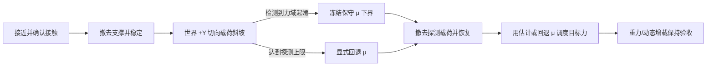

# 🧭 微滑移探测与保守摩擦估计

`friction-estimate` 在 oracle 目标力调度基线之上增加一条盲估计链路：固定预抓取法向力，沿世界
`+Y` 缓慢增加切向探测载荷，从左右逐 taxel 三轴触觉力中检测初始滑移，冻结保守摩擦系数下界
`μ_hat`，撤去探测载荷，再把 `μ_hat` 交给现有目标力调度器抵抗重力和动态附加载荷。

## 能力边界

估计器只接收以下量：

- 已知切向探测载荷；
- 左右触觉面的法向合力和剪切合力大小；
- 当前控制周期。

真实摩擦系数、物体位移和速度不进入估计器。它们只在仿真结束后用于评价估计误差、保守性和探测
位移。每次运行的 `effective_parameters.json` 会记录
`oracle_signals_used_by_estimator: []`。

当前 MuJoCo 模型提供逐 taxel 接触力，但没有真实硅胶内部形变、柱体微振动或视觉标记。因此本实现是
**力域初始滑移代理**：它验证探测状态机、保守下界和后续力控闭环，不能等同于实机 PapillArray
微滑移算法。文献中的典型做法同样在检测到初始滑移时记录切向/法向力比；真正的局部起滑检测则通常
依赖柱体形变、振动或分布式形变场（[Tremblay 与 Cutkosky，1993](https://bdml.stanford.edu/oldweb/touch/publications/tremblay_icra93.pdf)、
[Khamis 等，2018](https://contactile.com/wp-content/uploads/2022/01/KhamisEtAl2017_PapillArray_ProofOfConcept_preprint.pdf)、
[Sui 等，2021](https://ieeexplore.ieee.org/document/9565930/)）。

## 逐 taxel 局部观测

每个控制周期还会对左右触觉面的每个 taxel 独立计算局部摩擦利用率：

\[
\rho_{s,i}=\frac{\sqrt{F_{x,s,i}^2+F_{y,s,i}^2}}{F_{z,s,i}}.
\]

局部观测器只在法向力连续 `transition_confirm_s` 达到 `contact_enter_force_n` 后激活触点；已激活
触点的法向力连续低于更小的 `contact_exit_force_n` 后才退出。标准 task 使用 `0.05 N`、`0.025 N`
和 `0.01 s`，避免接触边缘的噪声造成状态抖动。分母为零时比值记为缺失值，不生成无穷大。

逐点接触掩码与 `ρ_{s,i}` 全部写入 `trace.csv`，同时记录有效触点数、按法向力加权的局部合成比、
局部 P90、最大值和极差。`taxel_plot.pdf`/`taxel_plot.png` 对比原有全 taxel 合力比与接触筛选后的合成比，
并显示探测阶段左右触觉面的逐点峰值热图。局部瞬时最大值对弱法向力和测量噪声仍然敏感，因此当前
只作为空间诊断量；现有保守 `μ` 估计和目标力调度继续使用经过验证的双侧总体摩擦比。

### 与 Khamis 等（2021）的逐柱方法对照

Khamis、Xia 与 Redmond 的 *Real-time Friction Estimation for Grip Force Control*（2021）使用
PapillArray 每根柱子的独立三轴力和位移观测。该方法没有用较大的局部 `T_i/N_i` 直接宣布起滑，
而是在每侧选择法向力最大的柱子作为参考柱；当某柱的切向速度低于参考柱切向速度的 60% 时，才将
它判为局部滑移，并把该事件时刻的 `T_i/N_i` 锁存为该侧摩擦估计。两侧分别估计，目标抓力取两侧
需求的较大值：

\[
F_N=\max\!\left(F_{N,min},\frac{1.2|F_{T,L}|}{\tilde\mu_L},
\frac{1.2|F_{T,R}|}{\tilde\mu_R}\right).
\]

现有触觉接口没有独立的 taxel 切向位移或速度，直接读取 MuJoCo 接触相对速度也难以和只输出三轴力的
目标硬件对齐。因此本项目不把仿真切向速度送入在线估计器，而是实现纯力局部起滑代理：滚动窗口先
确认某个 taxel 的 `T_i/N_i` 曾随加载上升，再检测比值饱和/下降，或该点剪切力占同侧总剪切力的比例
下降而同侧总剪切仍在增加。证据持续达到 `confirm_s` 后，锁存候选事件前窗口的局部比值分位数并乘
安全折减。左右侧分别输出候选下界，但当前仍只用于诊断，不接管目标力调度。

Niu 等的 *Synchronized Online Friction Estimation and Adaptive Grasp Control for Robust Gentle Grasp*
（2026）进一步说明力分布可以支持连续在线摩擦推断，但其粒子滤波观测模型假定接触系数已被控制在
目标附近。该同步估计思路适合后续保持阶段；当前阶段先保留显式切向探测和事件锁存，避免估计与控制
相互证实错误摩擦值。仿真物体运动只用于离线评价局部事件是否早于宏观滑动，不属于在线输入。

## 运行方法

名义摩擦场景：

```bash
uv run pgt run friction-estimate \
  --profile configs/custom_parallel_gripper.yaml \
  --task configs/friction_estimation/nominal_friction.yaml
```

标准 task 还包括：

- `low_friction.yaml`：`μ=0.35`；
- `high_friction.yaml`：`μ=1.2`；
- `noisy_friction.yaml`：`μ=0.8`，逐 taxel 测量噪声放大两倍。

## 阶段机



探测方向选世界 `+Y`，与世界 `-Z` 重力正交。每一侧先对 taxel 三轴力逐分量求和，再计算局部
剪切模，避免把可相互抵消的内部剪切错误累加：

\[
N_s=\max(0,F_{z,s}),\qquad
T_s=\sqrt{F_{x,s}^2+F_{y,s}^2},\qquad
\rho=\frac{T_L+T_R}{N_L+N_R}.
\]

## 探测与保守估计

探测器并行使用两个触觉判据：

1. 已知切向需求与触觉剪切支撑出现持续失配；
2. `ρ` 随探测载荷明显上升后趋于饱和，并且左右两侧摩擦比保持一致。

任一判据持续超过 `mismatch_confirm_s` 才锁存起滑，候选起滑期间的样本不再写入估计窗口，避免滑动
后的动力学污染静摩擦极限。确认后取起滑前窗口中 `ρ` 的高分位数并乘安全折减：

\[
\hat\mu_{LB}
=\operatorname{clip}\!\left(
  \eta Q_q\{\rho_k\}_{pre-slip},\ \mu_{min},\ \mu_{max}
\right),\qquad 0<\eta\leq1.
\]

标准场景使用 `q=0.85`、`η=0.9`；两倍噪声场景把 `η` 收紧到 `0.85`。高分位用于靠近摩擦极限，
折减用于吸收噪声和模型误差。如果达到
探测上限、接触不足或样本不足，则返回配置的 `fallback_friction_coefficient`，并把
`using_fallback` 置为真；不会把未起滑时的普通静摩擦利用率冒充真实 `μ`。

估计完成后的平均单侧目标力仍使用：

\[
f_{ref}=\operatorname{clip}\!\left(\frac{\gamma D}{2\hat\mu_{LB}},
f_{min},f_{max}\right).
\]

由于 `μ_hat` 是下界，同一安全系数下得到的目标力不小于使用真值的 oracle 目标。

## MuJoCo 求解条件

正式 task 必须显式设置 `noslip_iterations: 5`。实测关闭该后处理时，软接触在摩擦锥内的数值爬移
会让 `μ=0.2/0.5/0.8` 都在约 `0.52 N` 探测载荷下达到位移阈值，摩擦系数不可辨识；设置为 5 后，
起滑载荷和触觉比才随真实摩擦变化。提高到 20 的结果与 5 接近。MuJoCo 官方也说明 NoSlip
后处理用于抑制软接触模型的慢滑移；它不会阻止超过摩擦锥后的滑动
（[MuJoCo Modeling 文档](https://mujoco.readthedocs.io/en/latest/modeling.html#slow-slippage)）。

## 当前标准场景结果

默认 profile、`hard` 接触和固定噪声种子下：

| 场景 | 真值 μ | 保守估计 μ | 估计/真值 | 探测最大位移 | 后续保持最大位移 |
| --- | ---: | ---: | ---: | ---: | ---: |
| 低摩擦 | 0.35 | 0.310 | 88.6% | 0.006 mm | 0.002 mm |
| 名义摩擦 | 0.80 | 0.736 | 92.0% | 0.893 mm | 0.011 mm |
| 高摩擦 | 1.20 | 1.109 | 92.4% | 1.318 mm | 0.017 mm |
| 两倍噪声 | 0.80 | 0.714 | 89.2% | 0.114 mm | 0.007 mm |

四个场景的估计均不高于真值，后续动态载荷保持的真实摩擦裕量为正。上述结论只覆盖当前模型、任务和
噪声种子；迁移硬件前还需要多 seed 统计、真实切向加载标定和失败回退试验。

## 运行产物

每次运行保存 `profile.yaml`、`task.yaml`、`effective_parameters.json`、`trace.csv`、`metrics.json`、
`plot.png`、`plot.pdf`、`taxel_plot.png`、`taxel_plot.pdf` 和 `manifest.json`。`trace.csv` 同时记录触觉输入、残差、利用率、估计值、
探测载荷、目标力与物体运动；真实 `μ`、摩擦容量和物体运动字段仅用于离线评分。
