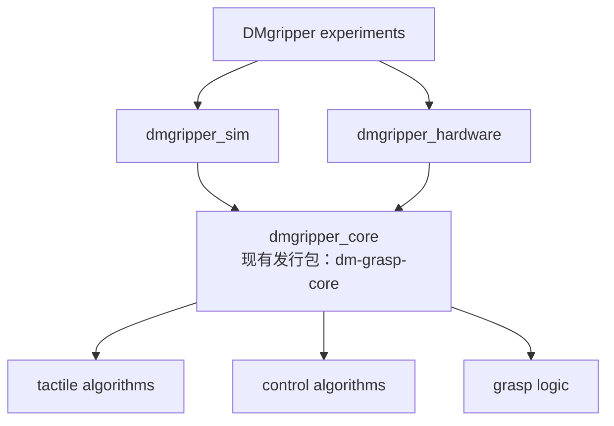

# 目录重构与纯 Python 真机联调计划

日期：2026-09-09。状态：实施中，P0 已完成；P1 已完成 `config`、`artifacts` 与
`analysis`／`visualization` 的首轮迁移；P2 已完成 DM 核首轮子域整理与 Robotiq
离散控制核心提取；P3 已建立 DM USB2CAN 状态刷新和 Robotiq 命令／反馈基础层，触觉采集及
受控实机验证仍待接入。

本计划记录下一阶段的目标布局与验收顺序，不表示所列包、接口或硬件能力已经落地。
当前架构仍以 [architecture.md](architecture.md) 为准；实施各阶段时同步更新该文档。

## 1. 目标与确定的边界

- 整理 `src/parallel_gripper_tactile`，让目录对应模块职责，逐步拆解顶层混杂模块。
- 使用纯 Python 完成商业触觉传感器与 DMgripper、Robotiq 2F-85 的真机联调。
  初版硬件程序不依赖 ROS、MuJoCo 或仿真资产。
- DM 与 Robotiq 的控制算法、状态机、观测、命令、配置和运行循环分别维护，
  不强制使用同一种控制器接口或控制周期。
- DM 保留 PID 系、导纳、直接力矩与 ADRC 等控制律；导纳仅是首批接入算法之一。
- 触觉模块负责双侧采集、协议解析、时间戳与数据适配。直接使用商业传感器输出，
  不开发传感器标定模块；如需设备自带清零或去偏，以显式设备命令封装。
- 共享仅限语义一致的触觉数据、目标力曲线、时钟工具、产物写入和分析能力。
  设备故障策略和控制状态不因复用工具而合并。
- 保持已有 profile、CLI、数据格式与实验结论可复现。目录迁移与算法行为修改分开提交。

本轮交付为计划与分支准备，不连接设备、不使能电机，不启动真机实验。

## 2. 已有基础与迁移来源

ROS 工作区来源根目录：
`/home/xiaodaliang/workspace/maintained/tactile_grasp_ros2/src`。

| 来源 | 已有内容 | 迁移方式 |
| --- | --- | --- |
| `packages/dm_grasp_core` | 独立导纳、运动学、接触过渡、MIT 请求与固定轨迹回归 | 保留包名和现有接口，逐步扩展 DM 专属算法 |
| 仿真 `control.py` | PID、刚度估计、MIT、直接力矩与 ADRC | 先厘清依赖，再迁入 DM 核；仿真量化和执行留在适配层 |
| 仿真 `discrete_force_control.py` 及 Robotiq 实验 | 离散状态机、单 tick 增益、预测和量化 PI 路径 | 提取为独立 Robotiq 核，先确认 PI 所在位置及依赖 |
| `contactile-papillarray-ros2/papillarray_serial_driver` | `protocol.py`、`serial_worker.py` 与协议／串口测试 | 提取纯 Python 解析和 I/O，移植现有测试 |
| `contactile-papillarray-ros2/papillarray_contact_processing` | 无 ROS 的处理核、滤波、符号和接触判定 | 按使用场景适配，避免与控制器重复滤波 |
| `dm_gripper_control/dmj4310_driver` | 固定官方 `vendor/DM_CAN.py`、独立探针和设备状态处理 | 保留协议依据，提取纯 Python 驱动生命周期 |
| `dm_gripper_control/dm_gripper_control` | 接近、输入新鲜度、HOLD／FAULT 与使能流程 | 审计设备行为后迁移，不把 ROS 回调原样搬入控制核 |
| `pyrobotiqgripper` | 用户选定的整数位置命令库 | 固定实际使用版本，增加独立适配器 |

提取前记录源仓提交、文件哈希、许可证和必要的协议测试向量。迁移后的算法应有唯一维护位置；
旧 ROS 项目暂保持原样，未来用版本化依赖接入，不长期跨仓复制文件或依赖绝对 `sys.path`。

## 3. 目标目录与依赖方向

DMgripper 采用“实验编排—仿真／真机适配—核心算法”结构：



图中的 `tactile algorithms` 只处理已经适配的触觉观测，例如滤波、接触判定、
滑移特征和力语义；商业传感器的串口、协议解析、清零命令、左右设备映射和时间戳
属于 `dmgripper_hardware/tactile`。`grasp logic` 负责接近、接触过渡、跟踪、保持和释放等
夹持状态，不负责设备通信。

`dmgripper_sim` 与 `dmgripper_hardware` 是同级适配器：前者把 MuJoCo 状态转换为核心观测并把
核心命令应用到仿真执行器，后者把商业触觉和 DM4310P 反馈转换为核心观测并通过 USB2CAN
发送命令。实验层选择运行后端、目标曲线和产物目录，不包含控制公式。

现有 Python 发行包名 `dm-grasp-core` 和导入名 `dm_grasp_core` 暂时保持，避免破坏 ROS 工作区
固定的 wheel、回放测试和导入路径；文档中的 `dmgripper_core` 表示其架构角色。若未来确需改名，
应单独发布新主版本并提供迁移期，不能夹带在目录整理中完成。

Robotiq 使用一棵平行结构：`robotiq experiments → robotiq_sim / robotiq_hardware →
robotiq_grasp_core`。两棵结构不共享控制算法、状态机、命令类型或调度周期。可共享的基础设施
仅限运行目录、日志格式工具、绘图样式和不带设备语义的时间序列任务描述；共享项不得反向依赖
任一夹爪核心。

对应的实施目标如下；首阶段完成依赖审计后，在不改变隔离原则的前提下细化文件拆分。

```text
packages/
├── dm_grasp_core/                  # dmgripper_core，沿用已有发行包和导入名
│   └── src/dm_grasp_core/
│       ├── interfaces.py          # DM 观测、参考与 MIT 请求
│       ├── tactile/               # DM 触觉算法，不含串口和设备适配
│       ├── control/               # 运动学、PID、刚度、导纳与 ADRC
│       └── grasp/                 # 接近、接触过渡、跟踪、保持与释放逻辑
├── robotiq_grasp_core/             # Robotiq 独立核心
│   └── src/robotiq_grasp_core/
│       ├── interfaces.py          # 整数命令与设备反馈语义
│       ├── tactile/               # Robotiq 触觉算法
│       ├── control/               # 量化 PI、单 tick 增益与动作选择
│       └── grasp/                 # WAIT_STABLE、ADJUST、HOLD 与 RELEASE
├── dmgripper_hardware/             # 无 ROS、MuJoCo 的 DM 真机程序
│   └── src/dmgripper_hardware/
│       ├── tactile/               # 双侧采集、协议解析与数据适配
│       ├── motor/                 # USB2CAN、DM4310P 协议与设备状态
│       ├── runtime.py
│       ├── recording.py
│       └── cli.py
└── robotiq_hardware/               # 无 ROS、MuJoCo 的 Robotiq 真机程序
    └── src/robotiq_hardware/
        ├── tactile/               # 双侧采集、协议解析与数据适配
        ├── gripper/               # pyrobotiqgripper 适配与设备状态
        ├── runtime.py
        ├── recording.py
        └── cli.py

src/parallel_gripper_tactile/
├── cli/
├── config/                        # 仿真 profile、校验与路径解析
├── simulation/                    # 原 simulation.py 需有兼容导出
│   ├── session.py
│   ├── scenes/
│   ├── tactile/                   # 仿真触觉后端
│   └── actuators/                 # DM、Robotiq 分别适配
├── backends/                      # dmgripper_sim 与 robotiq_sim 的仿真适配
│   ├── dm/                        # 仿真观测／执行器到 DM 核的适配
│   └── robotiq/                   # 仿真观测／执行器到 Robotiq 核的适配
├── perception/                    # 滑移与摩擦估计
├── tasks/                         # 参考曲线、力调度与扰动描述
├── experiments/
│   ├── dm/
│   ├── robotiq/
│   └── comparison/                # 跨后端触觉／接触对比
├── runners/
├── studies/
├── artifacts/                     # manifest、trace 与目录管理
├── analysis/                      # 指标与统计
├── visualization/                 # 绘图、视频与展示
└── assets/                        # 资产生成和转换工具
```

两个核心均不依赖 ROS、MuJoCo、串口、CLI 或模型路径；硬件包和仿真适配分别依赖对应核心。
DM 核与 Robotiq 核之间不相互导入。真机不能通过导入仿真主包获得通用工具。
确需跨两端共享的记录或数据类型先审计依赖，再决定是否提取小型公共包，避免过早建通用框架。

### uv workspace 组织

根项目继续作为 uv workspace 根。每个核心与硬件包拥有独立 `pyproject.toml`、发行包名、
运行依赖和测试目录；根锁文件统一固定开发环境。目标配置在相应目录实际创建后逐项加入，
不为尚不存在的包提前声明成员：

当前四个成员均已登记；硬件成员暂时只包含可离线验证的协议或适配边界。当前配置如下：

```toml
[tool.uv.workspace]
members = [
    "packages/dm_grasp_core",
    "packages/robotiq_grasp_core",
    "packages/dmgripper_hardware",
    "packages/robotiq_hardware",
]

[tool.uv.sources]
dm-grasp-core = { workspace = true }
robotiq-grasp-core = { workspace = true }
```

`parallel-gripper-tactile` 依赖两个控制核心，用于仿真适配；`dmgripper-hardware` 只依赖
`dm-grasp-core` 和 DM／触觉通信依赖；`robotiq-hardware` 只依赖 `robotiq-grasp-core`、
`pyrobotiqgripper` 和触觉通信依赖。两个硬件包互不依赖，也不依赖仿真主包。

开发时可从 workspace 根统一同步和测试，也必须验证成员可独立安装，防止根环境中偶然存在的
MuJoCo、ROS 或另一夹爪依赖掩盖边界错误：

```bash
uv sync --all-groups
uv run --package dm-grasp-core pytest packages/dm_grasp_core/tests
uv run --package robotiq-grasp-core pytest packages/robotiq_grasp_core/tests
uv run --package dmgripper-hardware pytest packages/dmgripper_hardware/tests
uv run --package robotiq-hardware pytest packages/robotiq_hardware/tests
```

具体包创建时再确认 `uv run --package` 与测试依赖组的最终命令。硬件依赖优先放在各成员中，
不加入仿真主包的基础依赖；需要访问真实设备的测试使用显式标记，与默认无硬件测试分开。

迁移清单至少覆盖：`profiles.py` → `config`；`scenes`、`simulation.py` 和触觉读取器
→ `simulation`；`tactile_slip.py`、`taxel_friction.py`、摩擦估计 → `perception`；
`run_artifacts.py`（保留兼容导出）和 trace 存储 → `artifacts`；`analysis.py` 已替换为
保持原导入路径的 `analysis/` 包；`plotstyle.py`、`friction_plots.py`（保留兼容导出）与视频展示
→ `visualization`。`recording.py` 当前混合演示循环与记录职责，应按函数拆分。
对同名模块改为包的情况，检查原路径导出、相对导入和包发现配置，不能只批量移动文件。

## 4. 两类控制算法的独立边界

| 项目 | DM | Robotiq |
| --- | --- | --- |
| 输出 | `q_des/dq_des/kp/kd/tau_ff` | `position_tick/speed_tick/force_tick` |
| 控制律 | 五个 PID 系变体、直接力矩、一阶历史 ADRC、二阶 ADRC 及 TD、导纳 | 量化 PI、固定单步、自适应死区、预测、动态步长 |
| 主要约束 | 机构行程、雅可比、速度、力矩与变化率 | 整数范围、动作间隔、稳定窗口与增益有效性 |
| 状态 | 接近、接触过渡、跟踪及设备故障处理 | 接近、等待稳定、调整、HOLD、再激活及释放 |

DM 首批迁移 `pid-torque-ff` 与 `admittance`，验证同一 DM 驱动可执行两种控制律。
其余 DM 变体逐一迁移，保留既有默认研究矩阵和历史控制时序；运行期间热切换不属于首版。
Robotiq 首批迁移量化 PI 与固定单步／HOLD，再接入自适应和预测变体。
迁移时完整复用控制语义；首批接入顺序不代表删除或替代其他算法。

## 5. 硬件与数据约定

### 触觉

保留 PTS 包计数、设备时间戳、主机单调时钟接收时间、左右传感器身份、有效状态和三轴力。
原始布局与统一布局之间显式映射，不假定 pillar 顺序就是三乘三阵列顺序。
平均单侧力保持 `f_n=(F_L+F_R)/2`，压缩为正；数据缺失不能用零力替代。
区分全局力与逐点求和的来源，不静默混用。设备时钟复位、重复帧、断连与重连均产生事件；
同一帧不重复计入接触确认或稳定窗口。主机接收时间不能冒充设备采样时间。

### DM4310P 与 USB2CAN

当前代码通过 PySerial 使用达妙 USB2CAN 封装，已有配置为 `921600` baud、
从机 ID `1`、主机 ID `17`；这些是来源配置，不代表已核对当前设备。
代码使用 `DM4310` 枚举并覆盖位置／速度／力矩编码范围为 `±1.7 rad`、
`±8 rad/s`、`±4 N·m`。连接阶段核对 DM4310P 固件对应范围、ID、模式、方向与机械行程。
协议量程与运行限幅分别保存，不把机械零位确认归入触觉传感器功能。

官方 `controlMIT()` 内部发送后调用 `recv()`；后者读取现有缓冲，返回不代表新反馈到达。
以实际解析事件更新反馈新鲜度，单一通信所有者管理 SDK 状态。
保留仿真历史量化，另用已确认的硬件协议向量验证编码，不能将 MIT 请求一致当作字节一致。
USB2CANFD 到货后依据实际型号、驱动和协议新增传输后端，不假定其接口与 USB2CAN 相同，
也不因适配器支持 FD 就改变电机帧格式。

### Robotiq

固定 `pyrobotiqgripper` 版本和连接参数，闭环不等待完整运动结束；仍要测量串口事务阻塞。
初期固定速度与力设置，外环调整整数位置。`force_tick` 不等于 N；分别记录目标命令、
设备目标回显和实际位置。速度或力设置改变后使旧单 tick 增益失效或重新确认。

### 运行时与产物

双侧触觉读取、设备 I/O、控制计算与日志写入解耦，通信端口各有唯一所有者。
控制读取最新完整快照，使用单调时钟和实际 `dt`；超期不连续补发积压动作。
DM 与 Robotiq 分别实现调度和故障策略，记录周期、测量年龄、反馈年龄、通信耗时和超期事件。
硬件记录分别标明请求值、受限发送值和设备反馈，不把发送完成当成设备执行确认。

根据实测时序确定周期和过期阈值；仿真 DM 的 4 ms、Robotiq 的 30 Hz 仅作对照。
核实设备侧通信超时保护，明确丢触觉／丢反馈时保持、受控释放或失能的条件。
重连恢复数据不自动恢复动作；设备动作验收独立于无硬件测试。
记录输入配置、核心版本、设备信息、原始数据、控制 trace 和故障原因，异步日志使用有界队列，
明确溢出记录与处理策略。离线分析区分原始力和滤波力，沿用已有指标的统计窗口。

## 6. 分阶段交付与验收

| 阶段 | 交付 | 验收 |
| --- | --- | --- |
| P0：冻结基线（已完成） | 合并旧分支；记录提交、导入路径、依赖和测试基线 | 工作区干净，原有全量门禁通过，列明跳过项 |
| P1：包内整理（进行中） | 按职责迁移；旧导入路径兼容层；缩减顶层提前导入 | CLI 与导入回归，固定轨迹一致，默认配置与产物字段不变 |
| P2：隔离控制核（进行中） | DM、Robotiq 独立包、类型、配置与测试；仿真适配器 | 两核独立安装，在无 ROS／MuJoCo 环境导入和运行；无交叉依赖 |
| P3：纯 Python 采集（进行中） | 已建立 DM 协议／PySerial／单次状态刷新与 Robotiq 3.3.12 非阻塞命令／位置反馈；待触觉读取、日志及完整设备状态 | fake 串口已覆盖拆帧、噪声、无关帧、超时、短写与异常关闭；待设备在线后验证真实采集 |
| P4：受限动作 | 分设备的使能、反馈读取、动作和停止流程 | 实机确认方向、行程、设备状态与停止；记录量程和实际时序 |
| P5：基础闭环 | DM 两基线；Robotiq PI 与固定单步；固定目标与 Ramp | 每台夹爪独立验收误差、峰值、丢数据和故障响应；记录参数与阈值 |
| P6：完整算法迁移 | DM 剩余控制律；Robotiq 自适应／预测；统一分析入口 | 按夹爪同条件比较，区分仿真与实机结论，完成回放和文档同步 |

执行顺序为 P0 → P1 → P2 → P3 → P4 → P5 → P6。P1 按功能批次提交，
避免一次移动所有模块。P2 可先完成两种夹爪的首批算法，剩余算法在 P6 收尾。
共享接口确定后才考虑代理并行处理互不重叠的 DM、Robotiq 文件；集成与最终验证统一完成。

每阶段更新实施状态、实际文件映射、文档和必要的 Unreleased 记录。实现提交遵循：

```bash
uv run ruff check .
uv run ruff format --check .
uv run pytest
```

扩展 pytest 收集范围以包含新增包。仅当本地插件干扰时使用
`PYTEST_DISABLE_PLUGIN_AUTOLOAD=1` 并记录原因；不跳过提交 hook。
硬件安装隔离测试和回放测试不能替代实机验收。真机性能阈值在 P4 测量后、P5 实验前固定，
不从仿真数字直接推定，也不在看到结果后修改验收口径。

## 7. 分支与下一次入口

将 `codex/friction-aware-force-scheduling` 快进合并到本地 `main`，保留原分支。
从合并后的 `main` 创建 `codex/python-hardware-architecture`，提交本计划，后续实现沿此分支推进。
本轮不推送远端。下一次从 P1 的导入／依赖审计与文件迁移清单开始，不直接启动硬件闭环。

实施前仍需核实：当前 DM4310P 固件参数、USB2CANFD 的实际型号与 SDK、
Robotiq 库版本和串口配置、触觉左右映射，以及设备是否在线。
这些事项不阻塞 P1、P2 和 P3 的无硬件部分。
